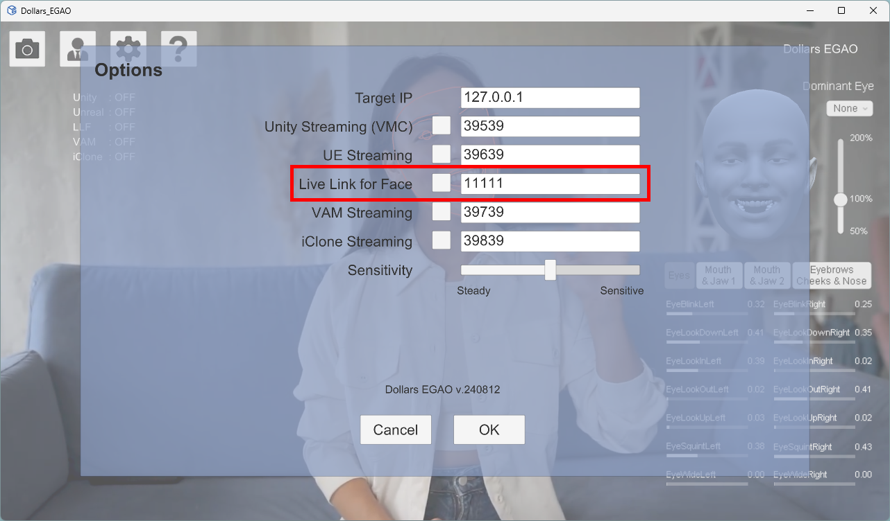
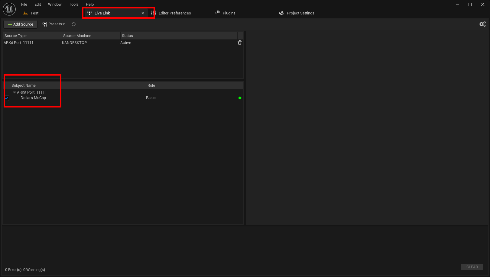
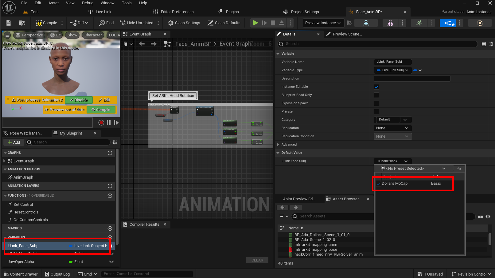

# Facial Capture Using LiveLinkFace Method
:::info

The following Dollars MoCap products support facial capture using the LiveLinkFace method,

- Dollars MONO (since v.240711)
- Dollars EGAO (since v.240812)
- Dollars NVIS (since v.240812)

:::

## Dollars MoCap Subject

For these products, you can enable the corresponding switch in the settings. You can also modify the port used according to your needs.

After enabling Live Link for Face, you should see a Live Link subject named Dollars MoCap in the Live Link window of the Unreal Editor.

:::warning

If you don't see the Dollars MoCap subject in the editor, please ensure that only one Unreal project is open.

:::

Once you see the Dollars MoCap subject, you can select it as the facial capture input in the animation blueprint.

The following is an example of MetaHuman.

## Using Your Own Characters

If you want to use Live Link Face with your own characters, please refer to this video,

<iframe width="640" height="360" src="https://www.youtube.com/embed/bFVMd7pMb3k" title="YouTube video player" frameborder="0" allow="accelerometer; autoplay; clipboard-write; encrypted-media; gyroscope; picture-in-picture; web-share" allowfullscreen></iframe>
