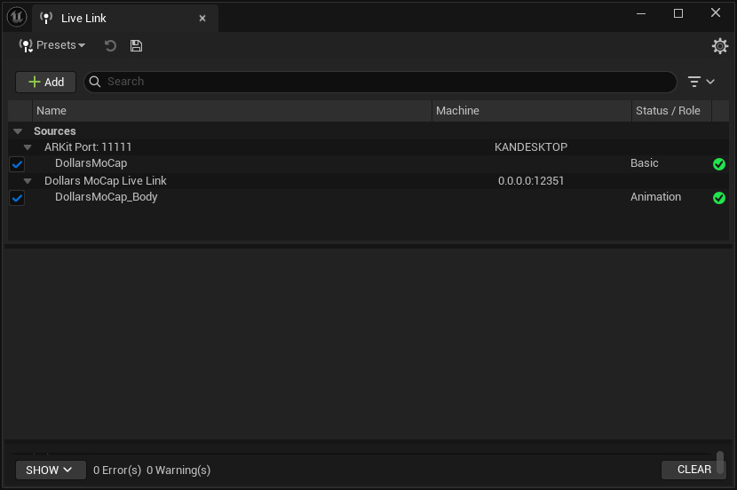
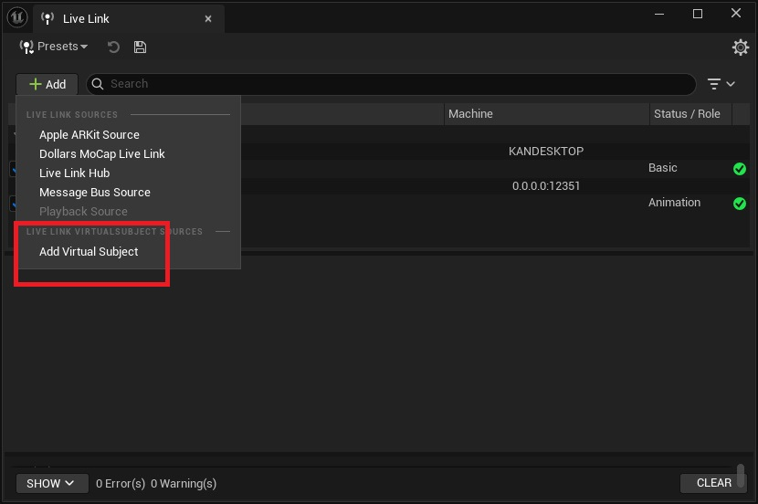
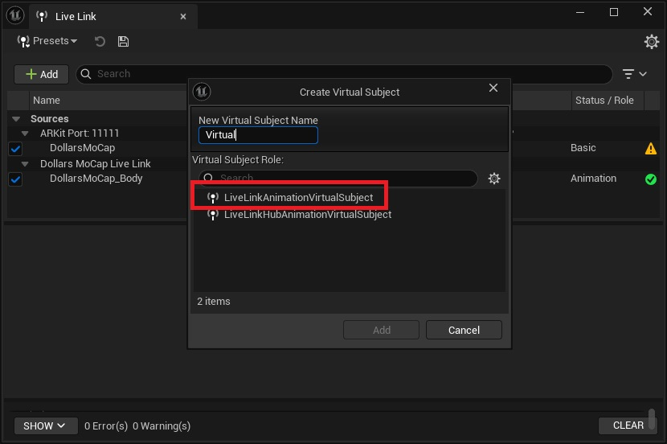
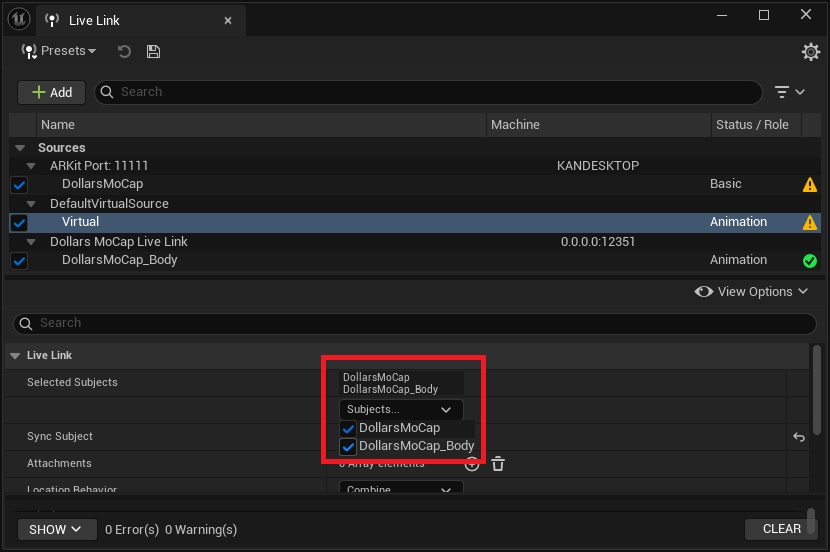
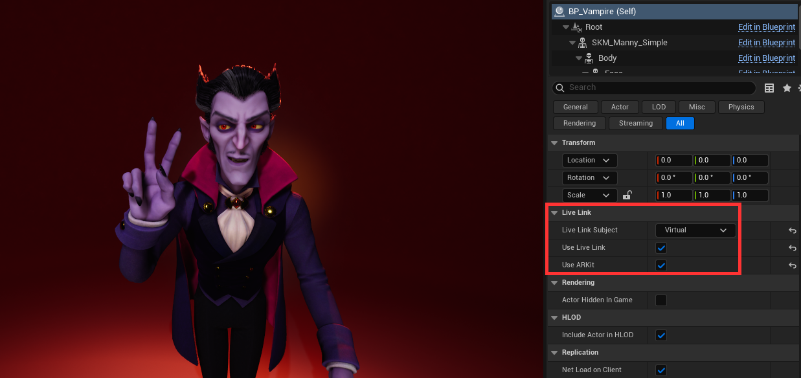

# Combining Motion and Facial Capture for MetaHuman

The default MetaHuman character blueprint provides only one Live Link Subject, so you cannot assign separate body and facial sources. You can use Live Link's Virtual Subject to combine motion and facial capture into a single Subject, and then assign it to the MetaHuman.

Before combining, set up the motion (body) and facial (face) Subjects separately. See [Using the Live Link Plugin](/ue-livelink) and [Live Link for Face](/ue-livelinkface).

:::info

This section uses Dollars MoCap's Live Link for Face as the example. If you use a Live Link Face app on your phone, simply replace the facial Subject with the corresponding one.

:::

1. In the Live Link window, create a new Virtual Subject.

2. Set the type to Animation.

3. In the Virtual Subject settings, check both the motion and facial Subjects so that it contains both the body skeleton and the facial data.

4. In the MetaHuman character blueprint, set the Live Link Subject to this Virtual Subject. It can now receive both body motion and facial expressions at the same time.

