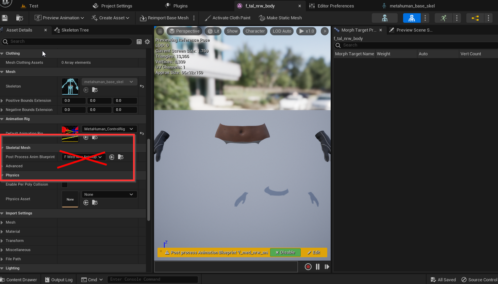

---
sidebar_position: 60
title: FAQ
slug: /ue-faq
---	

# FAQ

Thanks to the users who helped us resolve these issues!

import TOCInline from '@theme/TOCInline';

<TOCInline toc={toc} />

## How to Combine Facial and Motion Capture

You can combine facial animation and movement animation using the **Apply Additive** animation node, as demonstrated in the image below.

You can find examples of combining expressions and movements in almost all of Dollars' Unreal samples. It is recommended to download these for reference. The download links can be found in the descriptions of the videos.

## BluePrint Compile Errors

This usually occurs because the directory structure was changed outside of Unreal Editor, causing object references to break. We recommend following [the steps here](/ue-getstarted) to rectify the issue.

## Motion lags in Unreal when the mocap program is in the background

Please try turning off "Hardware-accelerated GPU scheduling".

Go to **Settings** > **System** > **Display** > **Graphics** > **Change Default Graphics Settings**, toggle off the option, and restart the computer.

## Motion Capture Does Not Work After Packaging in Unreal Engine 5.x

You can try the following solutions,

- Change the Unreal Editor interface to English.

- If you are working on a MetaHuman project, remove the Post Process Animation Blueprint from the Animation Blueprint.

## Unable to Copy Ctrl Rig in Unreal Engine 5.1

Copying the Ctrl Rig in Unreal Engine 5.1 can cause crashes. Currently, there is no direct solution. As a workaround,

You can import the skeletal model into a lower version of Unreal Engine, create the Ctrl Rig there, and then copy the Ctrl Rig asset into your 5.1 project.

## How to Record Motion and Facial Animation

Please refer to the following video, starting at around 4:43.

<iframe width="640" height="360" src="https://www.youtube.com/embed/xqTqWk1jUQ0?si=sczqh-mTOV2gpj5O&amp;start=283" title="YouTube video player" frameborder="0" allow="accelerometer; autoplay; clipboard-write; encrypted-media; gyroscope; picture-in-picture; web-share" allowfullscreen></iframe>

## Capture Fails After Switching Animation Blueprints

You can modify the animation blueprint by changing the **Begin Play** event to **Initialize Animation** event, as shown in the following image,

Please note that switching animation blueprints at runtime may cause the character to have no animation. It is recommended to switch between motion capture and animation sequences within the same animation blueprint by using state changes. You can refer to [here](/ue-advanced).

