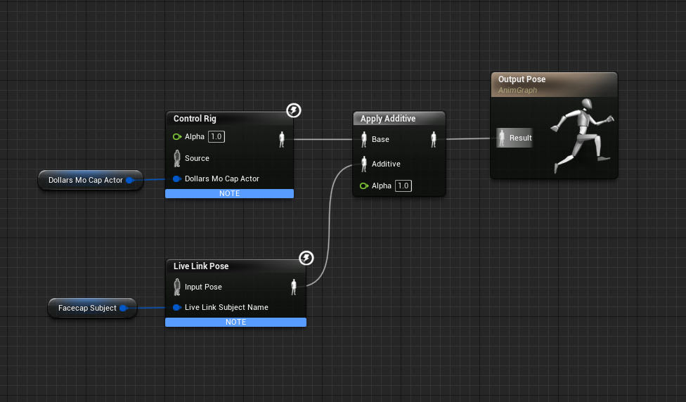
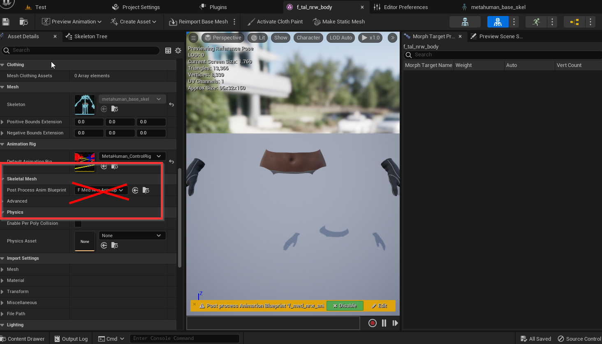
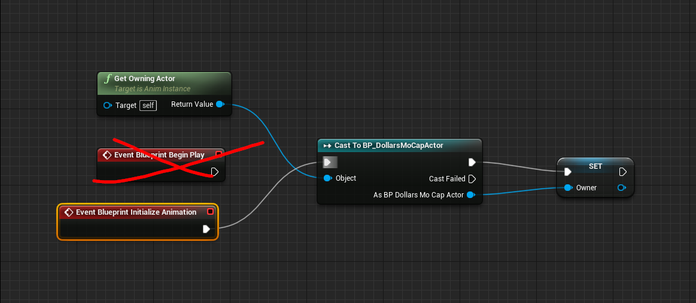

---
sidebar_position: 30
title: 📢 FAQ
slug: /ue-faq
---	

# FAQ

import TOCInline from '@theme/TOCInline';

<TOCInline toc={toc} />

## How to Combine Facial and Motion

You can combine facial animation and movement animation using the Apply Additive animation node, as demonstrated in the image below.

You can find examples of combining expressions and movements in almost all of Dollars' Unreal samples. It is recommended to download these for reference. The download links can be found in the descriptions of the videos.

## BluePrint compile errors

Suggest comparing against the video to check for errors in the blueprint, and particularly recommend downloading the example project from the video description for comparison.

## Dropped frames in Unreal Engine

When the Unreal Engine window is active, it may cause motion capture to drop frames. You can try:

- Keeping the window of another program active

- Limiting the Unreal Engine's frame rate

## Errors after Packaging in Unreal Engine 5.x

You can try the following two points:

- Change the Unreal Edtor interface to English

- If it's a MetaHuman project, remove the Post Process Animation Blueprint from the Animation Blueprint

## Unable to copy Ctrl Rig in Unreal Engine 5.1

Copying the Ctrl Rig in Unreal Engine 5.1 causes crashes, and there is no direct solution for the time being.

You can import the skeletal model into a lower version of Unreal Engine, create the Ctrl Rig there, and then copy the Ctrl Rig asset into 5.1.

## How to record motion and facial expressions

Please refer to the following video, starting at around 4:43.

<iframe width="640" height="360" src="https://www.youtube.com/embed/xqTqWk1jUQ0?si=sczqh-mTOV2gpj5O&amp;start=283" title="YouTube video player" frameborder="0" allow="accelerometer; autoplay; clipboard-write; encrypted-media; gyroscope; picture-in-picture; web-share" allowfullscreen></iframe>

## Motion capture fails after switching animation blueprints

You can modify the animation blueprint by changing the Begin Play event to Initialize Animation, as shown in the following image

Please note that switching animation blueprints at runtime may cause the character to have no animation. It is recommended to switch between motion capture and animation sequences within the same animation blueprint by using state changes. You can refer to [here](/ue-advanced).

