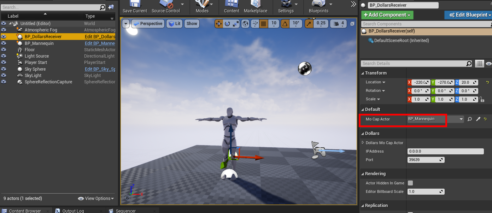
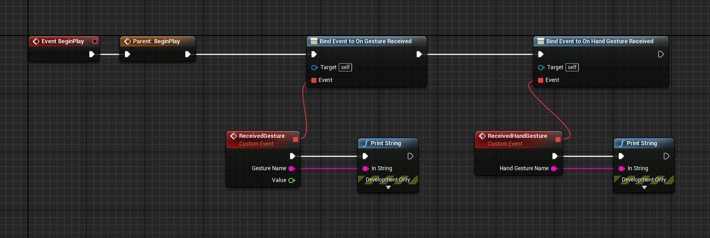

# Gesture Recognition

:::info

The following Dollars MoCap products support sending gesture events to UE,

- Dollars SOMA
- Dollars DEEP Lite

:::

The process of receiving gesture events in an Unreal project is similar to receiving motion capture data. The steps are as follows:

## 1. Add the Plugin

First, you need to add the plugin to your project. You can view related information [here](/ue-getstarted).

## 2. Prerequisites

To receive gesture events, please ensure the following conditions are met:

- Your character blueprint inherits from ```BP_DollarsMoCapActor```
- Add  ```BP_DollarsReceiver``` to the scene and select this Receiver in your character blueprint.

## 3. Receiving Gesture Events

In addition to the above settings, you also need to perform the following operations:

**- Set MoCapActor in the Receiver**

If you want to receive gesture events, besides specifying the Dollars Receiver in the character blueprint, you also need to specify the character blueprint in the Dollars Receiver.



**- Bind Gesture Events**

You need to bind On Gesture Received and On Hand Gesture Received events in your character blueprint.

The image below shows a simple example.



## Event Parameter Description

- The ```gesture``` parameter indicates the name of the captured body or hand gesture.
- For ZoomIn and ZoomOut gesture, the ```value``` parameter represents the ratio of the current distance between hands to the distance when the action was triggered.
- For other gestures, this ```value``` is always 0.
