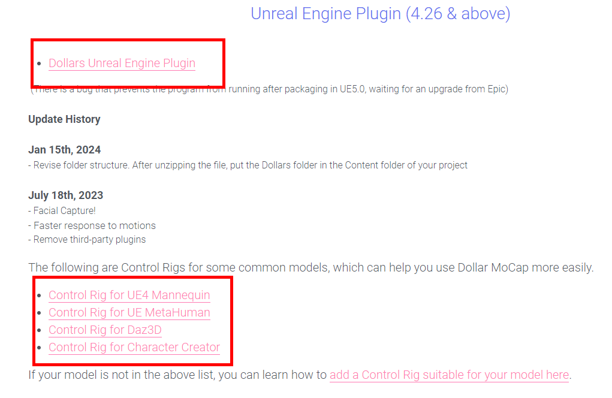
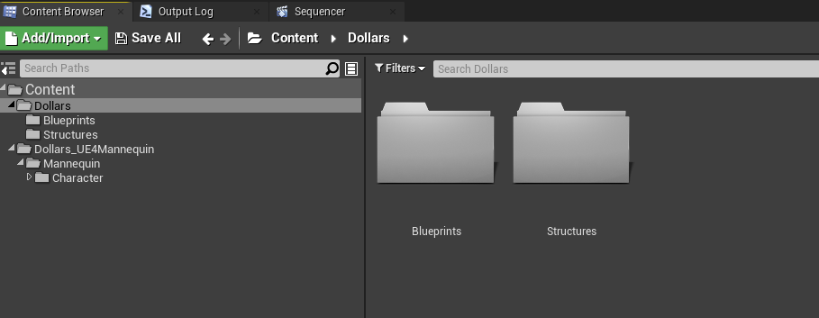
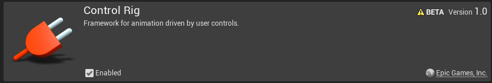
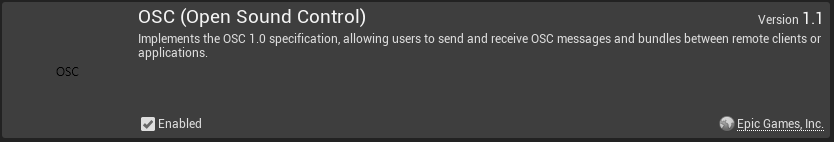
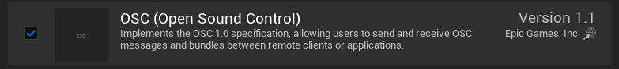

---
sidebar_position: 5
title: Get Started
slug: /ue-getstarted
---	
# Get Started

## Unreal Engine Versions

Dollars MoCap supports 4.26, 4.27, and all 5.X versions of Unreal Engine.

However, there is an issue with motion capture not functioning after packaging in version 5.0, so it is recommended to use version 5.1 or higher.

## Download Dollars MoCap Plugin and Control Rig

You need to download the Unreal plugin and the required Control Rig from the Dollars MoCap website.

## Copy the Plugin to Your Projects

Unzip the downloaded file and copy the **Dollars** directory and the Control Rig directory (here we use UE4 Mannequin as an example) to the **Content** directory of your project. Make sure the **Dollars** directory structure remains unchanged.

After opening your project, the file structure should look like below,

:::warning
Changing the location of the **Dollars** directory during the initial copy will cause compilation errors.
:::

:::info
If you wish to change the location of the **Dollars** directory, you can open the project, ensure it compiles correctly, and then move the directory within the Unreal Editor.
:::

## Activate the Plugins

- In Unreal Engine 4 (UE4): Activate the **Ctrl Rig** and **OSC** plugins.

- In Unreal Engine 5 (UE5): Since **Ctrl Rig** is activated by default, you only need to activate **OSC**.

## Get Started!

After activating the plugins and restarting the project, the preparations are complete, and you can start integrating Dollars MoCap with your characters.

You can further explore methods for integrating different skeletons with Dollars MoCap [here](/ue).