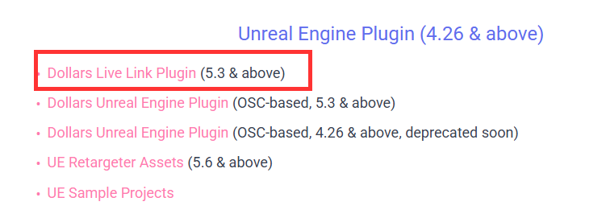
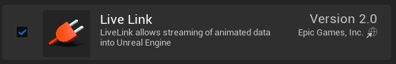
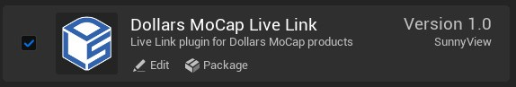
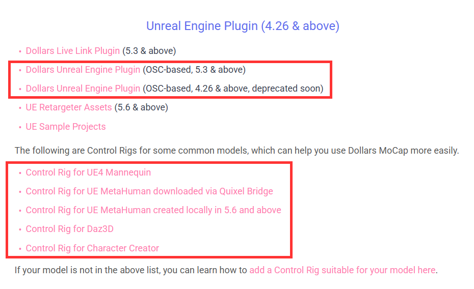
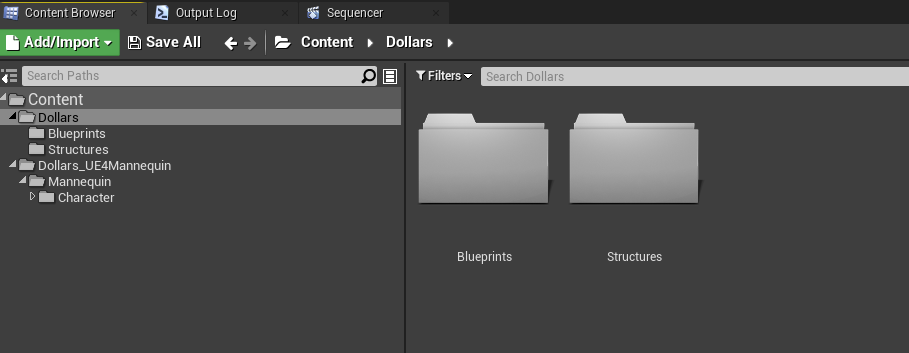
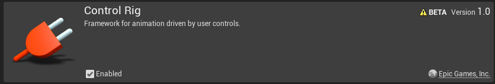
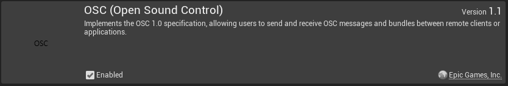
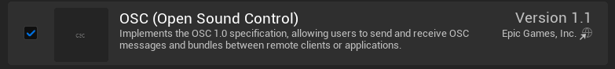

---
sidebar_position: 10
title: Get Started
slug: /ue-getstarted
---	
# Get Started

## Plugin Types

Dollars MoCap provides two plugins for Unreal Engine: Live Link and OSC. Choose one based on the Dollars MoCap product you use and your target character.

:::tip Recommended
If your Dollars MoCap product supports Live Link, we recommend using it first.
:::

## Unreal Engine Versions

### Live Link-based Plugin

Supports Unreal Engine 5.3 and higher.

### OSC-based Plugin

Supports Unreal Engine 4.26, 4.27, and all 5.X versions.

However, there is an issue with motion capture not functioning after packaging in version 5.0, so it is recommended to use version 5.1 or higher.

## Live Link Plugin

### Download the Plugin

Download the Live Link plugin from the Dollars MoCap website.



### Copy the Plugin to Your Project

Unzip the downloaded file, choose the plugin directory that matches your Unreal Engine version, and copy it into the `Plugins` folder at the root of your project (create the folder first if it does not exist).

After copying, the project structure should look like this,

```
YourProject/
  Plugins/
    DollarsMoCapLiveLink/
```

### Activate the Plugins

After opening the project, in Edit > Plugins make sure the following plugins are enabled,

- **Live Link** (built into Unreal Engine)
- **Dollars MoCap Live Link** (provided by Dollars MoCap)





Restart the project after enabling them.

## OSC Plugin

### Download the Plugin

Download the Unreal plugin and the required Control Rig from the Dollars MoCap website.



### Copy the Plugin to Your Project

Unzip the downloaded file and copy the **Dollars** directory and the Control Rig directory (here we use UE4 Mannequin as an example) to the **Content** directory of your project, keeping the **Dollars** directory structure unchanged.

After opening your project, the file structure should look like below,



:::warning
Changing the location of the **Dollars** directory during the initial copy will cause compilation errors.
:::

:::info
If you wish to change the location of the **Dollars** directory, open the project, ensure it compiles correctly, and then move the directory within the Unreal Editor.
:::

### Activate the Plugins

In Unreal Engine 4, you need to activate the **Ctrl Rig** and **OSC** plugins.





In Unreal Engine 5, since **Ctrl Rig** is activated by default, you only need to activate **OSC**.



## Get Started!

After completing the installation above, the preparations are complete, and you can start integrating Dollars MoCap with your characters.

Go to [Using Your Characters](/ue-characters) to learn more about integrating different skeletons with Dollars MoCap.
