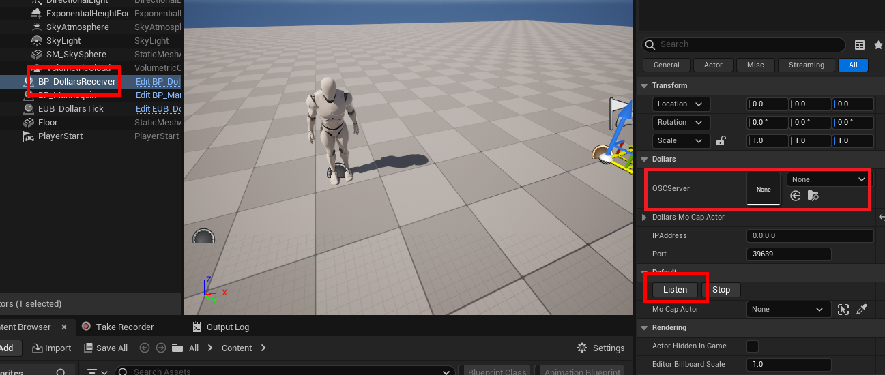
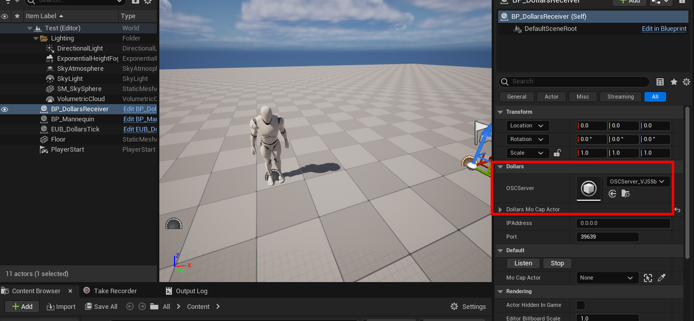
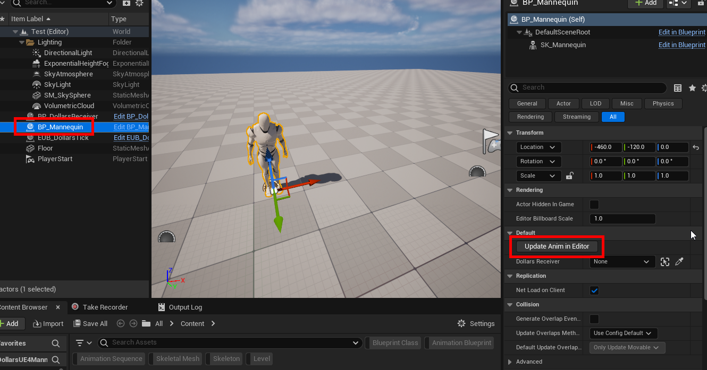

---
sidebar_position: 30
title: Using the Plugin in the Editor(Beta)
slug: /ue-ineditor
---	
# Using Dollars MoCap Plugin in UE Editor

## Download the Plugin and Control Rig

Compatible with UE5.3 and above

- Unreal Engine Plugin

https://kilimanjaro.dollarsmocap.com/ineditor/Dollars.zip

- Control Rig for UE4 Mannequin

https://kilimanjaro.dollarsmocap.com/ineditor/Dollars_UE4Mannequin.zip

- Control Rig for MetaHuman

https://kilimanjaro.dollarsmocap.com/ineditor/Dollars_MetaHuman.zip

## Sample Projects

- UE4 Mannequin

https://drive.usercontent.google.com/download?id=1vxRN-WnplO-BMeUs5lecrM12WX6YGvO7&export=download&authuser=0

- IK Rig-Driven Character

https://drive.usercontent.google.com/download?id=11wwUxRap5BoDB2lCZ9KWceTUJzJfsAi0&export=download&authuser=0

- MetaHuman

https://drive.usercontent.google.com/download?id=19P-NaPRptPstWC6JLAnDQ_QNEco4YxPJ&export=download&authuser=0

## Using the Sample Project (UE4 Mannequin)

1. In the scene, select **Dollar Receiver** and click **Listen** in the details panel.

2. You will see that the **OSCServer** variable is assigned.

3. Select the character blueprint and click **Update Anim in Editor** in the details panel.

4. Enable UE Streaming in the Dollars application, and you will be able to control the character directly in the editor in real time, without entering Play mode.