# Using the Live Link Plugin

:::info

The following Dollars MoCap products support Live Link motion capture,

- Dollars MONO (from v.260623)

:::

## Preparation

First follow the instructions in [Get Started](/ue-getstarted) to install the Dollars MoCap Live Link plugin and enable the Live Link plugin in Unreal Engine.

## Enable Live Link Streaming in Dollars MoCap

In the Dollars MoCap settings, turn on the Live Link streaming switch. You can also change the port if needed.

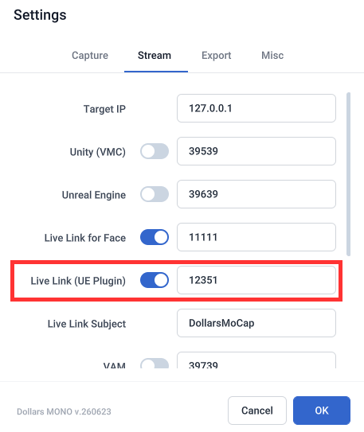

## Add a Live Link Source

Open the Live Link window in the Unreal Editor, and under Source add a Dollars MoCap Live Link source. If you changed the port in the previous step, enter the same port here.

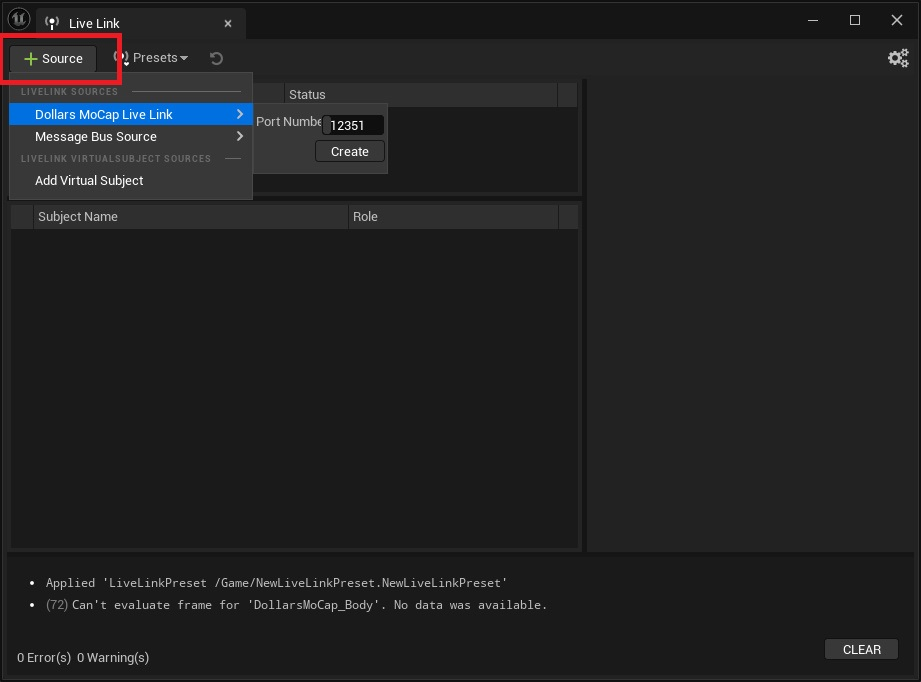

Once added, you will see the corresponding Subject.

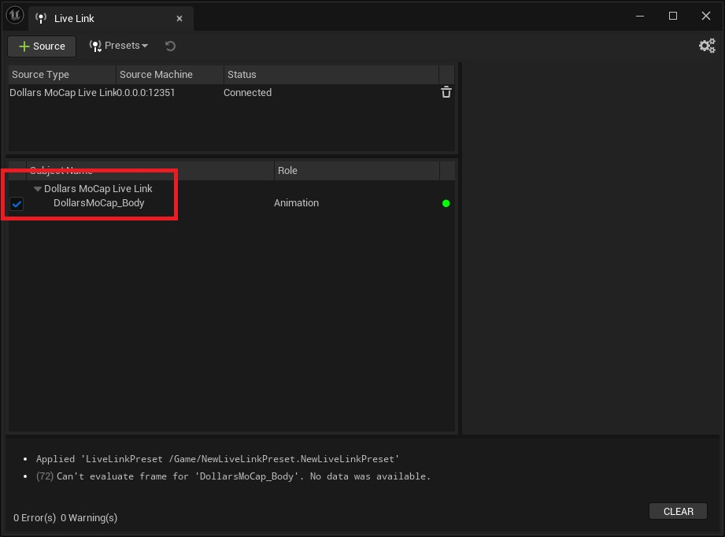

If multi-person mocap is enabled, you will see up to five Subjects.

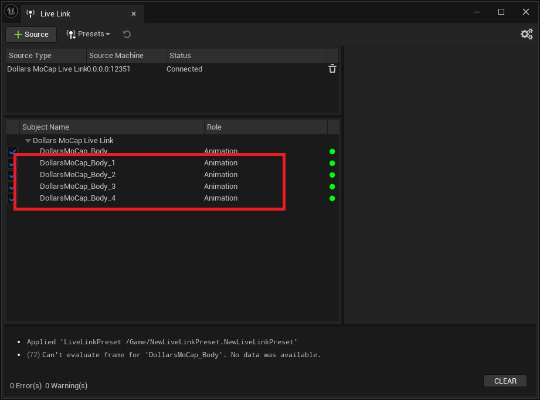

:::warning

If you cannot see the Dollars MoCap Subject in the editor, make sure only one Unreal project is open.

:::

## Receive the Motion

Dollars MoCap's Live Link streams motion data on the standard skeleton of Unreal's sample character **SKM_Manny_Simple**.

If your project does not yet include this character, click Add in the Content Browser to add content,

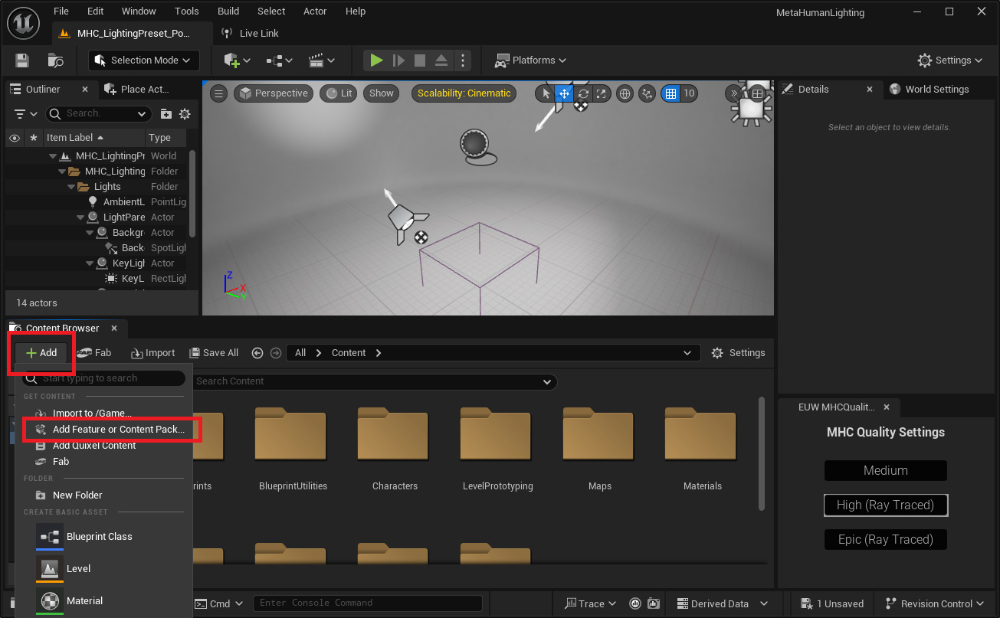

choose a Third Person or Top Down template that contains this character,

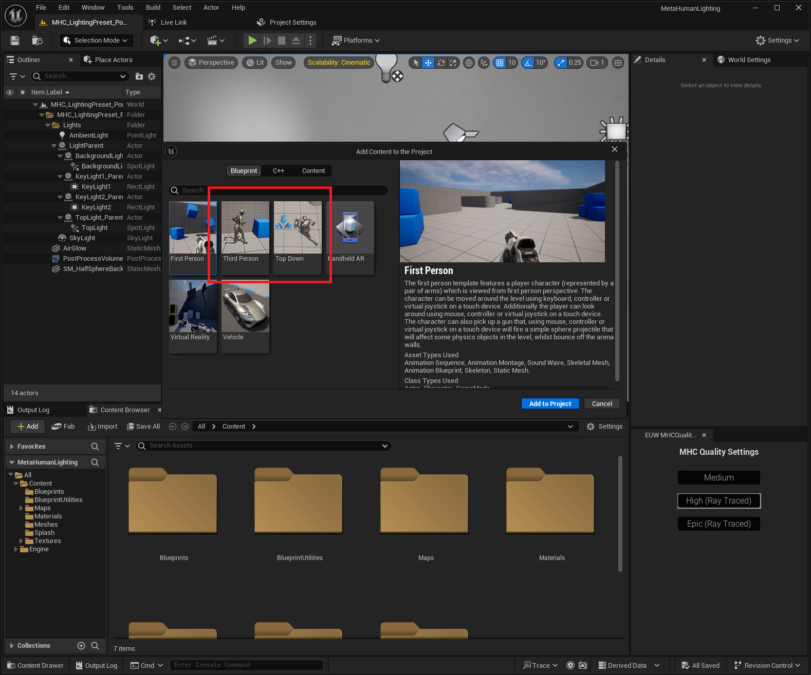

then select SKM_Manny_Simple and right-click to create an Animation Blueprint,

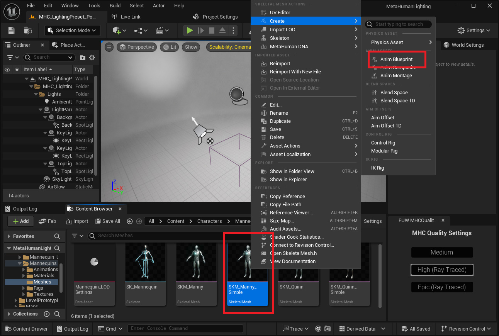

in which you add a Live Link Pose node and set the motion source to Dollars MoCap.

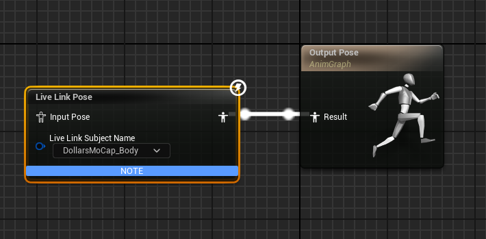

Once done, SKM_Manny_Simple can receive the motion directly.

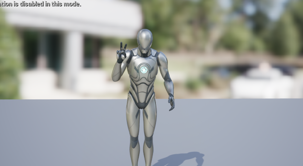

## Drive Your Character

After confirming that SKM_Manny_Simple receives the motion correctly, you can start driving your own character. If your character uses a different skeleton, you first need to retarget the motion from SKM_Manny_Simple.

The following uses Epic's [MetaHuman Vampire](https://www.fab.com/listings/59278ffd-5879-4538-affb-a65a829acc54) as an example.

### Create IK Rigs

Create an IK Rig for both SKM_Manny_Simple and SKM_Vampire_Body, and set up their Retarget Chains.

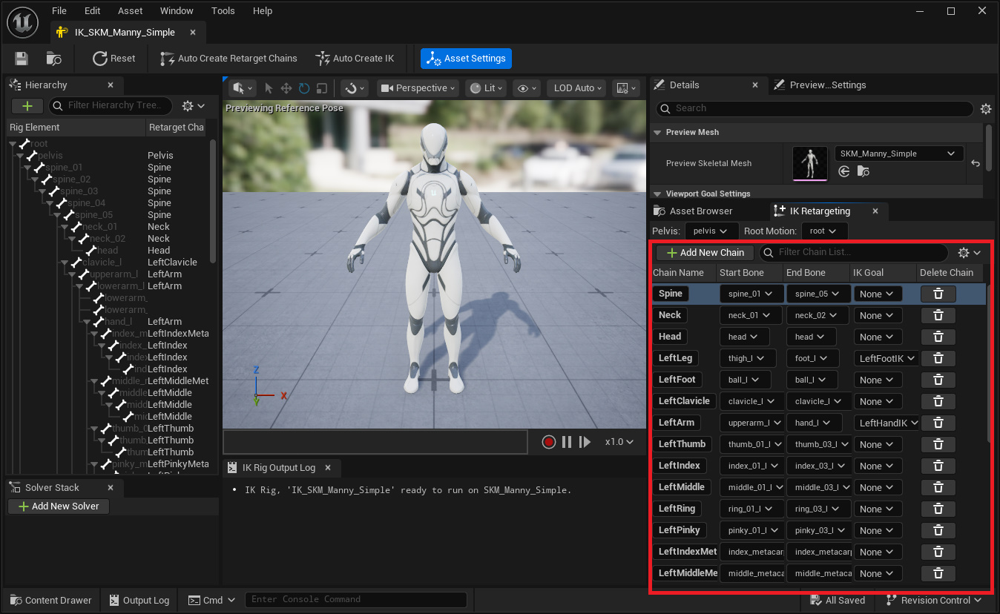

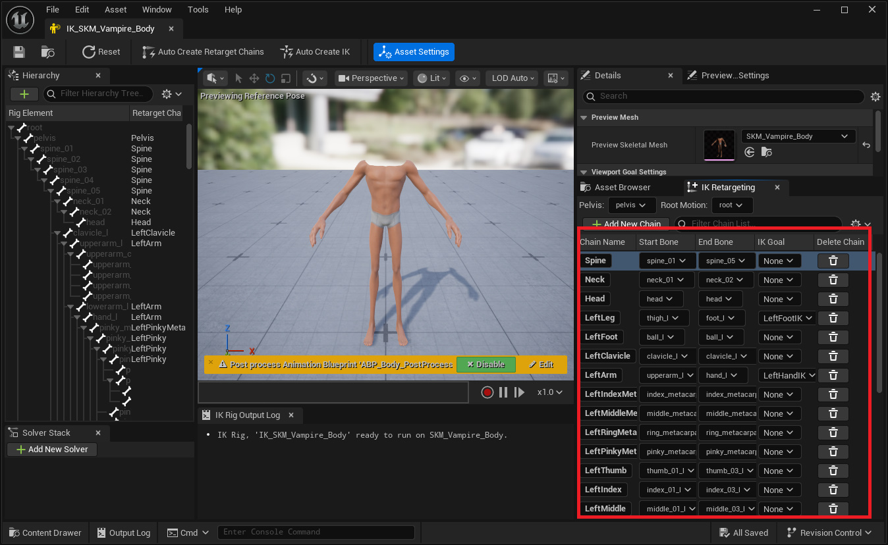

### Create an IK Retargeter

Create a new IK Retargeter, set the Source to the IK Rig of SKM_Manny_Simple, and the Target to the IK Rig of SKM_Vampire_Body.

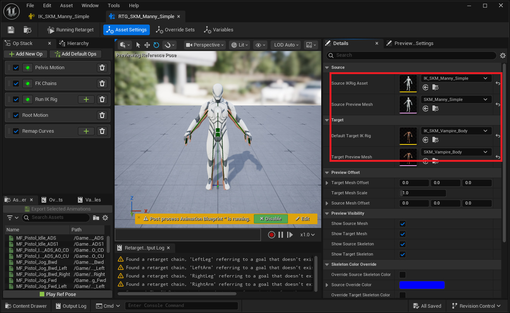

### Add SKM_Manny_Simple to the Character Blueprint

Add SKM_Manny_Simple to the character blueprint, placing it under Root as the parent of the Vampire's Body, and assign it the Animation Blueprint created in the "Receive the Motion" section.

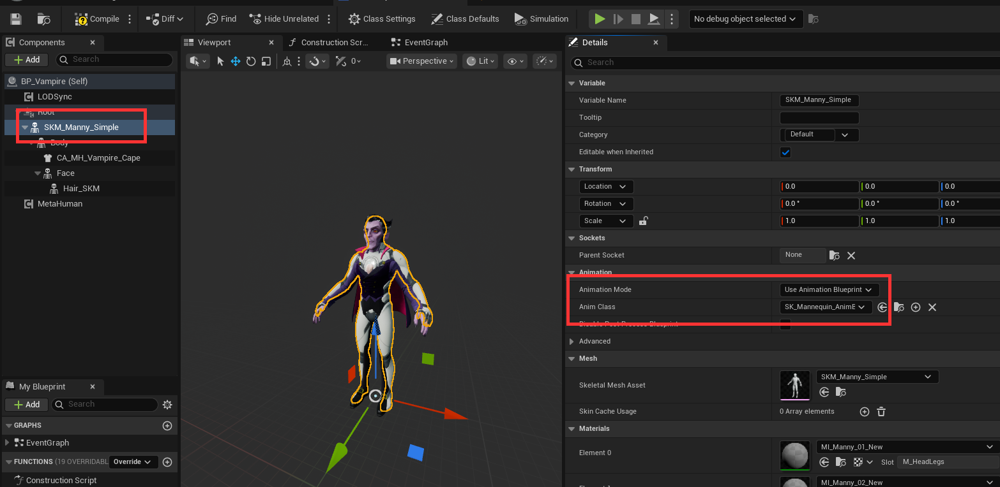

Uncheck Visible so that SKM_Manny_Simple only receives the motion and is not displayed.

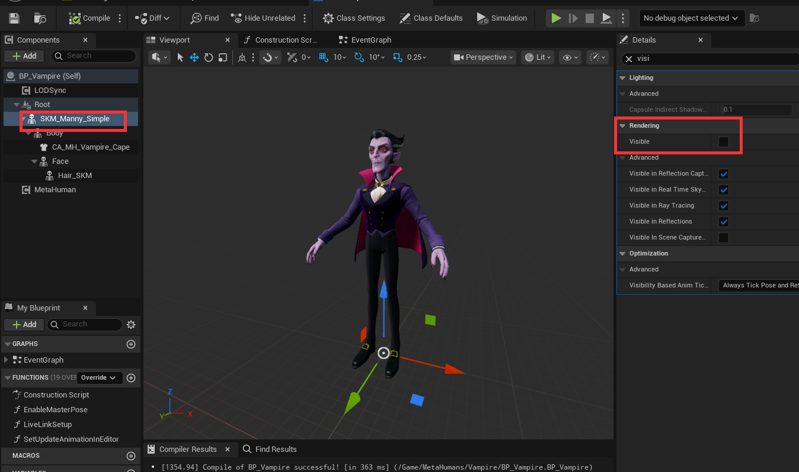

### Retarget in the Animation Blueprint

In the Vampire's Animation Blueprint, disconnect the existing Copy Pose From Mesh and add a Retarget Pose From Mesh node instead.

- Set Retarget From to Parent, which points to the Live-Link-driven SKM_Manny_Simple
- Set the IK Retargeter Asset to the IK Retargeter created earlier

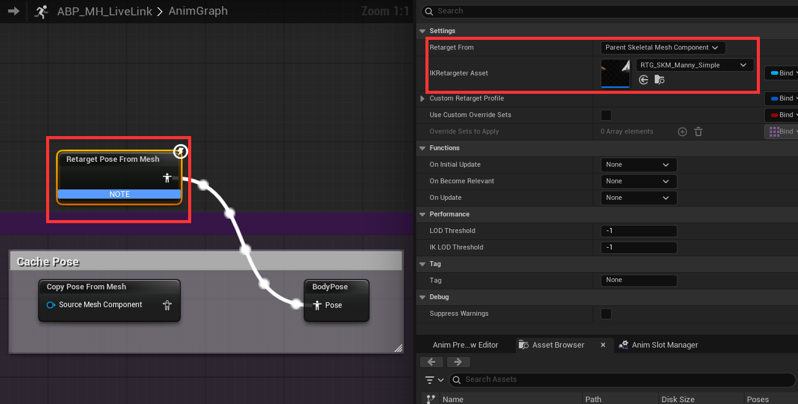

The purpose of this step is that the hidden SKM_Manny_Simple first receives the standard-skeleton motion output by Dollars MoCap, and then Retarget Pose From Mesh retargets it onto the Vampire's skeleton via the IK Retargeter.

This way, even with a different skeleton, your character can follow Dollars MoCap's motion.

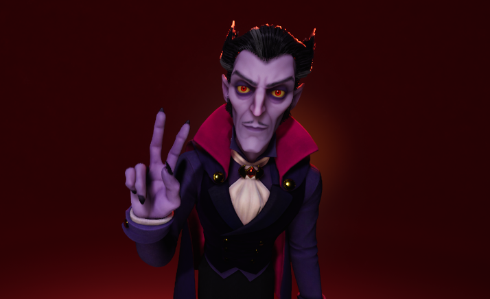

The finished project for this section is available on the [UE Samples](/ue-samples) page, as the MetaHuman (using MetaHuman Vampire Character Asset, UE 5.8) project.

## Packaging

The Live Link source is not saved with the level, so before packaging you need to save it as a Preset and have it load automatically on startup.

After adding the source, save it as a Preset in the Live Link window.

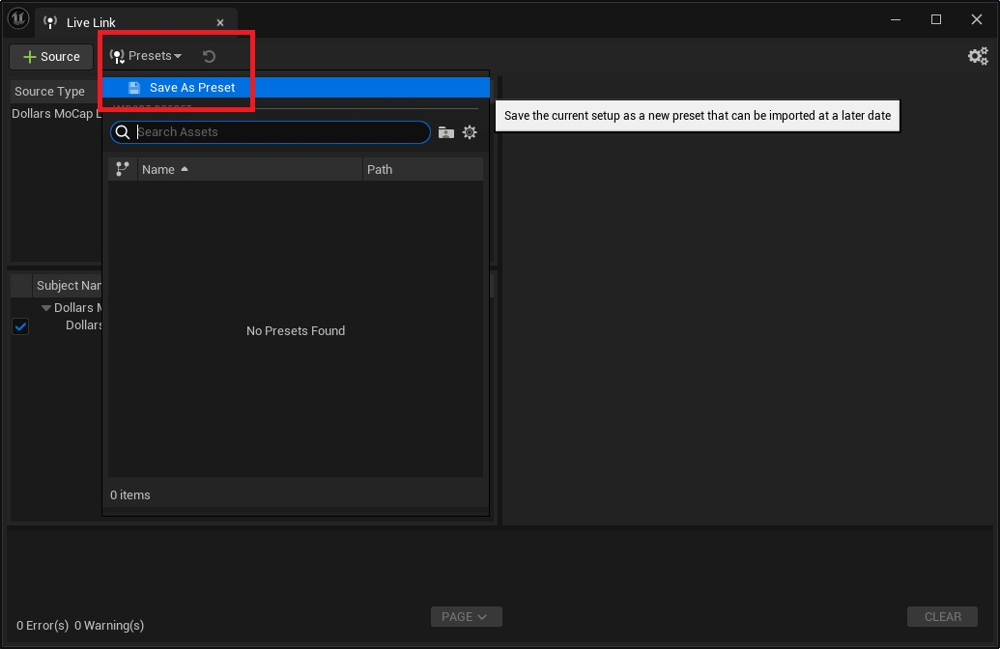

Open Edit > Project Settings, and under Plugins > Live Link on the left, set Default Live Link Preset to the Preset you just saved. It will then load automatically when the program starts.

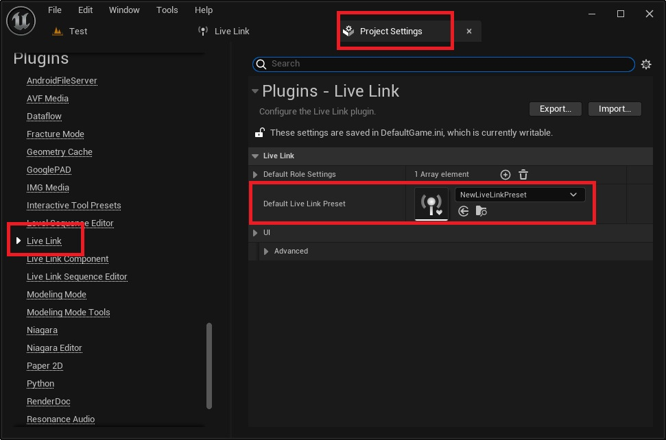

:::warning

Before running the packaged program, close the Unreal Editor. Otherwise the port used by Live Link will be occupied by the editor, and the packaged program will not be able to receive motion data.

:::
