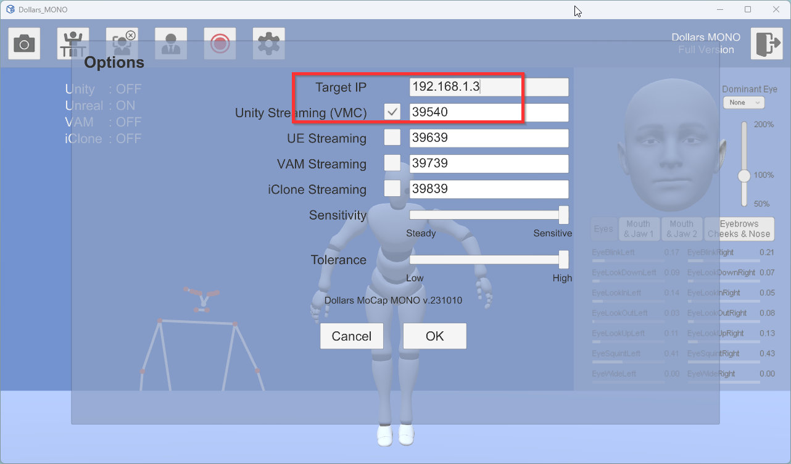
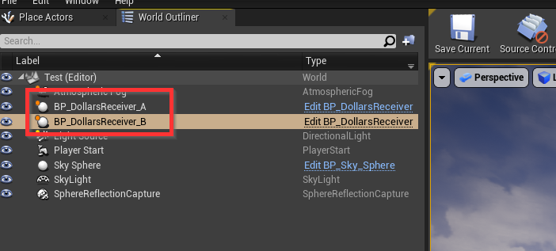
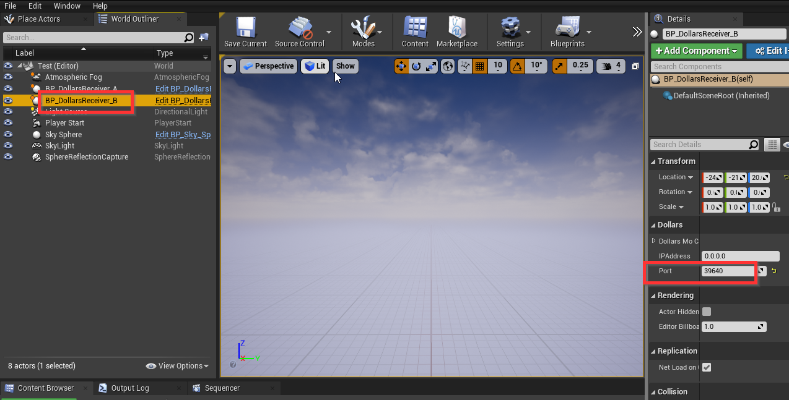
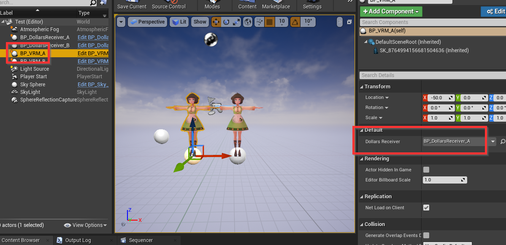
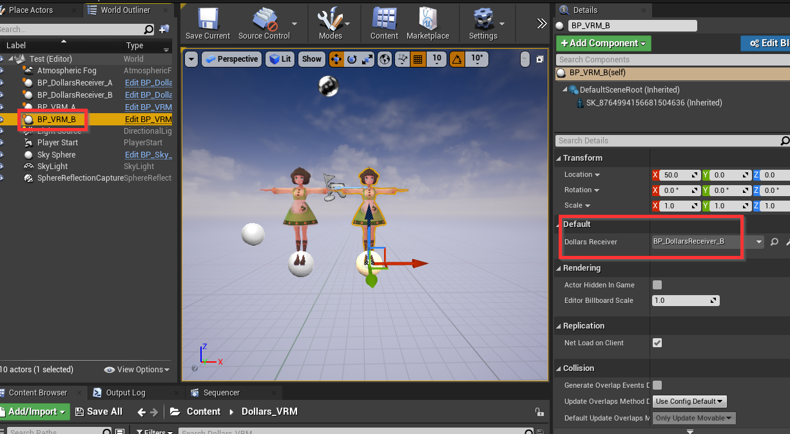

# Multi-person motion capture

You can run the Dollars MoCap program on multiple computers separately, and gather the motion capture results into the same Unity scene to achieve multi-character interaction on the same scene.

For instance, if we want to perform motion capture on Computer A (with IP address 192.168.1.3) and Computer B (with IP address 192.168.1.10), and combine the results into the Unity scene on Computer A, we would set up the systems accordingly to communicate with each other and sync the data for a unified output on Computer A's Unity scene.
:::info
Please first ensure that Computer B can ping Computer A. If the ping is unsuccessful, check the firewall settings on Computer A.
:::

On Computer A, we run the Dollars MoCap program as usual.

On Computer B, after running the Dollars MoCap program, we open the options dialog box, enter the IP of Computer A, 192.168.1.3, in the IP field, and change the Unity port to a number other than 39539, for example, 39540, as shown in the following image.

:::info
You can also run multiple instances of the Dollars MoCap program on the same computer. In this case, keep the IP as the default local address, 127.0.0.1, and just make sure to set the Unity port numbers to different values for each instance.
:::

In the Unreal Engine scene on Computer A, add two instances of the BP_DollarsReceiver Blueprint.

For easy identification, name them respectively BP_DollarsReceiver_A and BP_DollarsReceiver_B.

Select BP_DollarsReceiver_B and change its Port to the number 39540, which is the port number we set earlier on Computer B. 

Add two character blueprints into the scene. Name them respectively BP_VRM_A and BP_VRM_B.

In the BP_VRM_A blueprint, set the Dollar Receiver variable to reference the BP_DollarsReceiver_A you've added to the scene

For BP_VRM_B, you should set the Dollar Receiver variable to reference the BP_DollarsReceiver_B in the scene.

At this point, BP_VRM_A is controlled by the motion capture program running on Computer A, and BP_VRM_B is controlled by the motion capture program running on Computer B.

You can download a sample Unity project with the above setup from the following link:

https://drive.google.com/u/0/uc?id=1EGJmPzi_JL2YCRALKkuhpXTWmZZV0Ckc&export=download