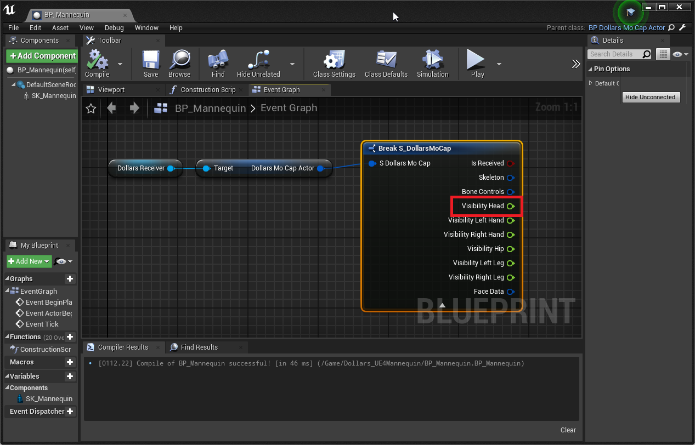

---
sidebar_position: 15
title: Tracking Status
slug: /ue-visibility
---	
# Actor Tracking Status

## Tracking Status

You can use the `Visibility Head` in the DollarsMoCap data structure to determine whether an actor is currently being tracked.

When an actor is being tracked, the value is usually greater than 0.95.

The method to obtain this in the character blueprint is as follows,

Here is how to get it in the animation blueprint,

In addition to `VisibilityHead`, DollarsMoCap also contains the following tracking values, which you can use as needed,

- VisibilityLeftHand

- VisibilityRightHand

- VisibilityHip

- VisibilityLeftLeg

- VisibilityRightLeg