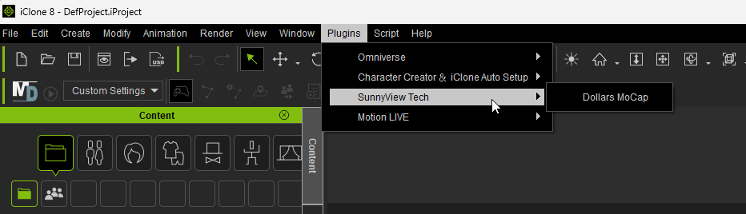
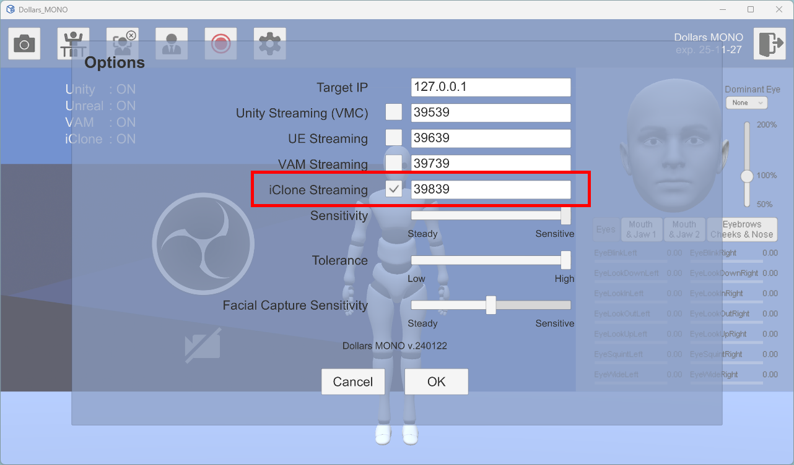
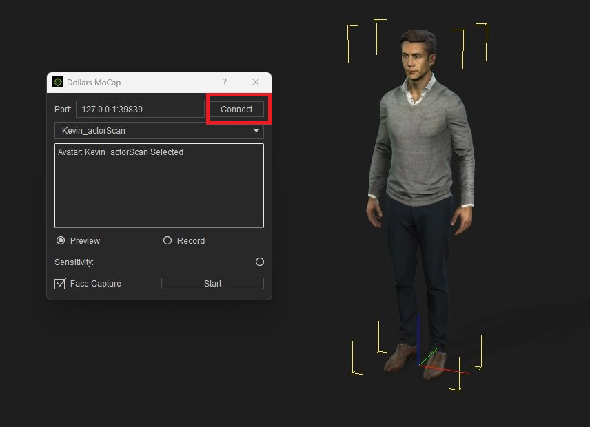
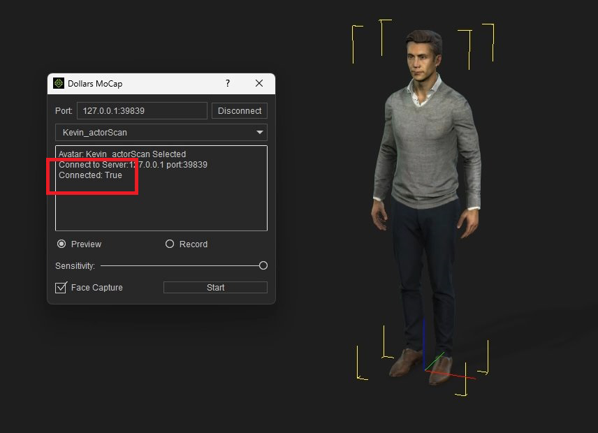
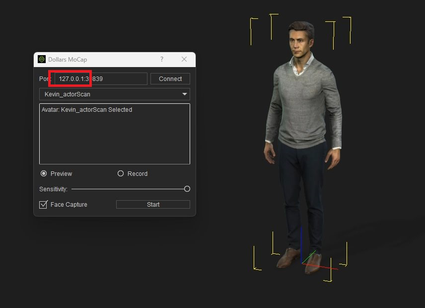

# Using Dollars MoCap Plugin in iClone8

## Download and Install Dollars MoCap Plugin

You can download the Dalle iClone8 plugin from the [Dollars MoCap website](https://www.dollarsmocap.com/download) or the [Reallusion Plugin Marketplace](https://marketplace.reallusion.com/dollars-markerless-mocap).

Unzip the downloaded file and copy the DollarsMarkerlessMoCap directory into the plugins directory of iClone8.

Typically, the plugin directory is located at C:\Program Files\Reallusion\iClone 8\Bin64\OpenPlugin.

After a correct installation, you will see the Dollars MoCap plugin in the Plugins menu of iClone.



## Enable iClone Streaming in Dollars MoCap Programs

Open the Dollars MoCap program you're using and check the iClone Streaming option in the Settings window.



:::info

If you're using Dollars LINK, there's no need to check the iClone Streaming option. Dollars LINK will automatically listen for connection requests from iClone upon startup.

:::

## Launch the Plugin, Connect to Dollars MoCap programs

After adding a character in iClone, open the Dollars MoCap plugin from the menu.

Click the Connect button in the plugin.



A message showing ```Connect: True``` indicates a successful connection to the Dollars MoCap program.



Then, click the Start button to begin capturing.

If you see ```Connect: False```, check whether the iClone Streaming option is enabled in the Dollars MoCap program. If it's confirmed to be on, try changing the port from 39839 to another number in both Dollars MoCap and the iClone plugin, and then try reconnecting.

:::warning

If you add or delete characters in the scene, you need to reopen the Dollars MoCap plugin.

:::

## Connect Across Computers

If the Dollars MoCap program and iClone are not on the same computer, you can change ```127.0.0.1``` in iClone to the IP address of the computer running the Dollars MoCap program.

The settings on the Dollars MoCap program don't need to be changed.


