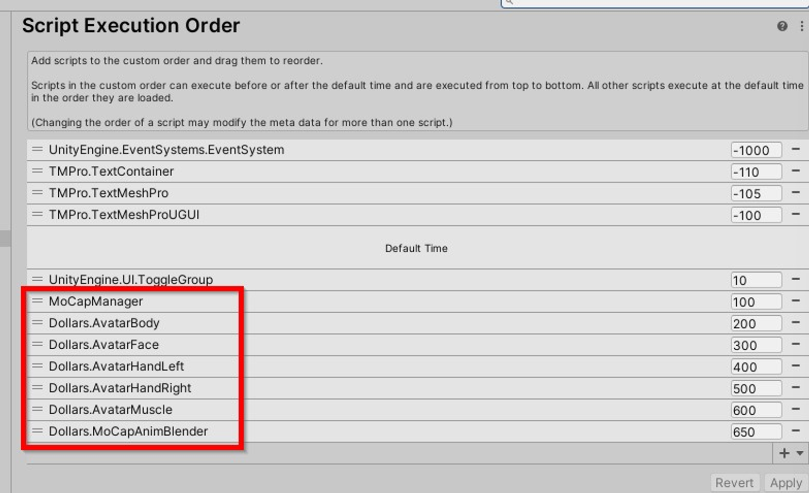
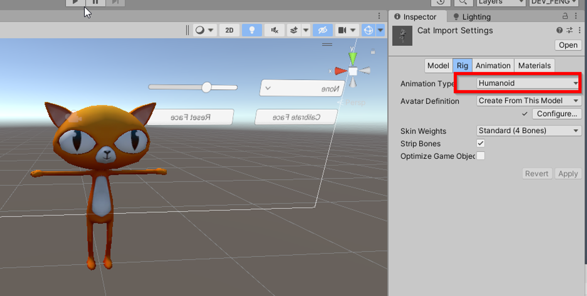
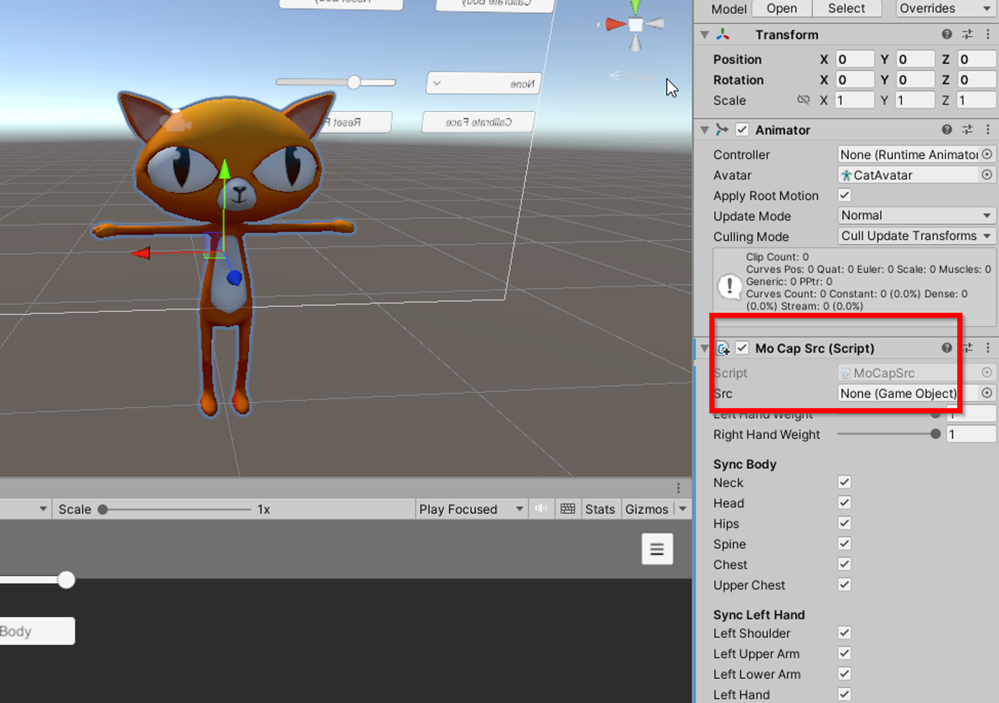
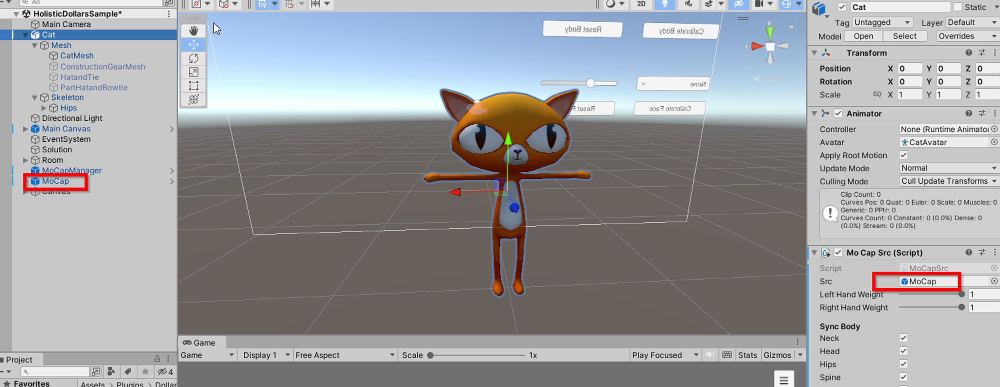
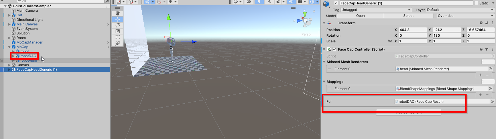
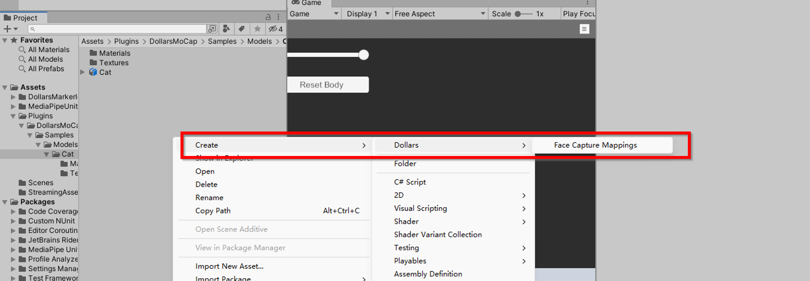
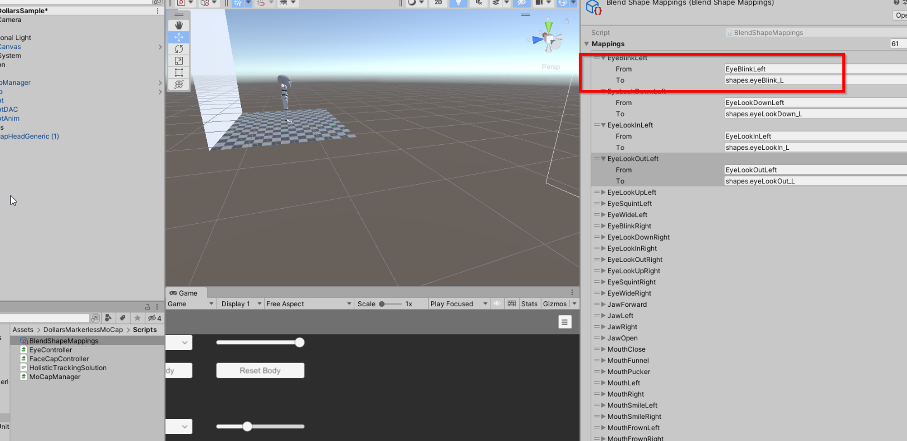
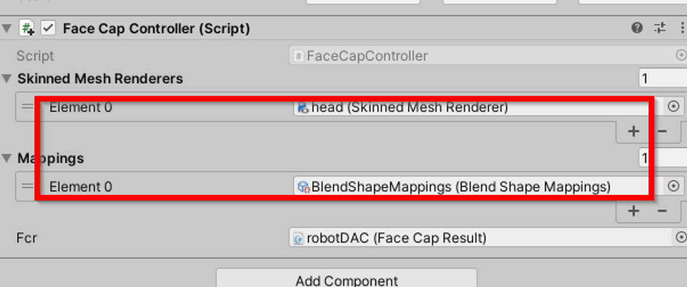

# Dollars Markerless MoCap SDK Guide

## Introduction

This SDK is based on the [MediaPipeUnityPlugin](https://github.com/homuler/MediaPipeUnityPlugin) project and runs on Unity platforms other besides WebGL.

## Data types

### Dollars.MoCapMode

MoCap Mode

Type: Enumeration
Values: jump, flat, upperbody

### Dollars.DominantEye

DominantEye in Facial Capture

Type: Enumeration
Values: none, left, right

### Sensitivity

Sensitivity of Motion Capture

Type: Integer
Values: 1-5, 1 is the most stable, 5 is the most sensitive

### Strength

Strength of Facial Capture

Type: Float
Values: Unrestricted, but a range between 0.5 to 2 is recommended, 1 is the default

## Classes

### AvatarBody

Used for calculating skeletal data

#### InitFilter(int sensitivity)

#### SetMoCapMode(Dollars.MoCapMode mode)

#### SetSensitivity(int sensitivity)

#### Calibrate()

Description:

Based on the current output of MediaPipe, adjust the avatar to stand upright with both feet on the ground.

MediaPipe's human body will be tilted forward (see below), the degree of tilt varies depending on the camera parameters, the size of the person, etc.

Therefore, it is recommended to perform a calibration before starting in order to achieve better motion capture results.

Just relax and look ahead while calibrating.

#### ResetCalibration()

Description:

Used to reset the calibration data, recommended to be called when changing cameras as well as video files.

### AvatarFace

Used to get face capture data

#### Calibrate()

Description:

Use current face capture expression parameters as a baseline

#### ResetCalibration()

Description:

Used to reset the facial calibration data.
Recommended to be called at the same time as AvatarBody.ResetCalibration().

#### SetStrength(float strength)

Description:

Set the strength of facial capture

#### SetDominantEye(Dollars.DominantEye eye)

Description:

Set the dominant eye in facial capture

## How to Use

### Conventions

Please call the functions below before starting mocap,

`AvatarBody.InitFilter(5);`

`AvatarBody.SetMoCapMode(MoCapMode.jump);`

This will initialize the filter and set the motion capture mode, the order cannot be changed.

You can use MoCapManager.cs in the example project as a reference.

Additionally, ensure that MoCapManager.cs is executed before any motion capture-related code by specifying the execution order.

Please keep the order in the screenshot above for motion capture related codes.

### Add Motion Capture to an Avatar

Set the model's Rig to Humanoid and ensure all bones are correctly configured

Add the model to the scene and attach a MoCapSrc component

If the model is not in a TPose, adjust the bone angles to set the model into a TPose.

In the MoCapSrc component, set the src variable to the MoCap object in the scene

Done!

### Add Face Capture to an Avatar

Add the Face Cap Controller component to the avatar, and set its Fcr variable to the robotDAC under MoCap in the scene

Create a Face Capture Mapping file

In the 'To' column of the Mapping file, fill in the names of the blendshapes corresponding to each facial capture expression, paying attention to case sensitivity.

In the Skinned Mesh Renderers array of the Face Capture Controller, enter the avatars meshes with blendshapes.

In the Mapping array, fill in the mapping files

Notes:

- If there is no blendshape corresponding to a certain facial capture expression, leave the corresponding position in the mapping file empty.
- The TongueOut column and those that follow in the mapping file can be ignored.
- If you need to use the same facial capture expression to control multiple blendshapes, you can add the same mesh multiple times to the Skinned Mesh Renderers array and correspond them to different mappings.
- The lengths and orders of the Skinned Mesh Renderers and Mappings arrays need to be the same.