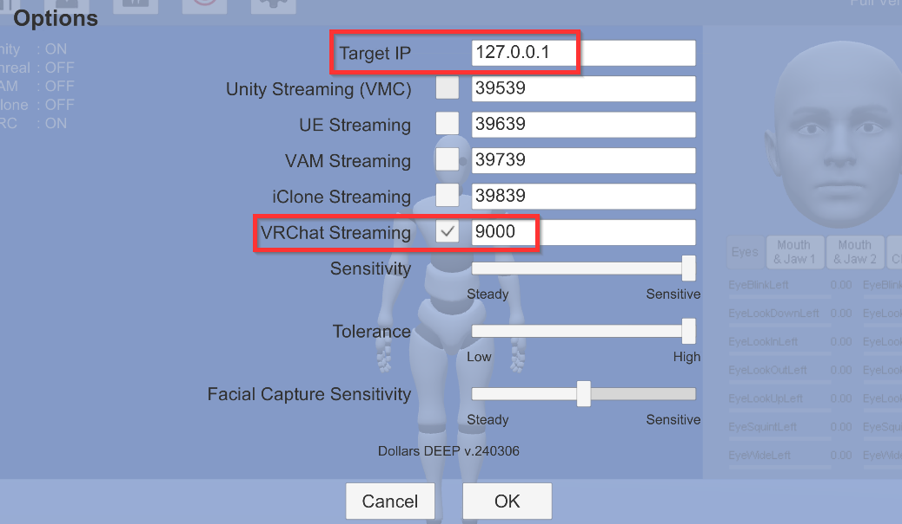
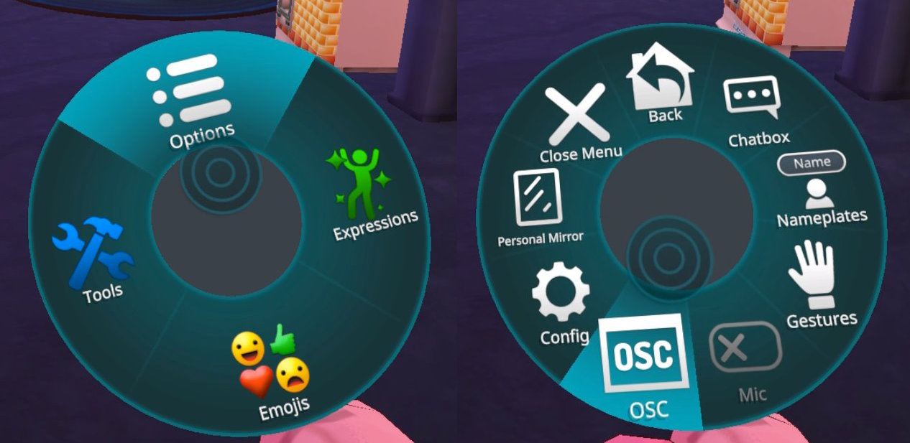
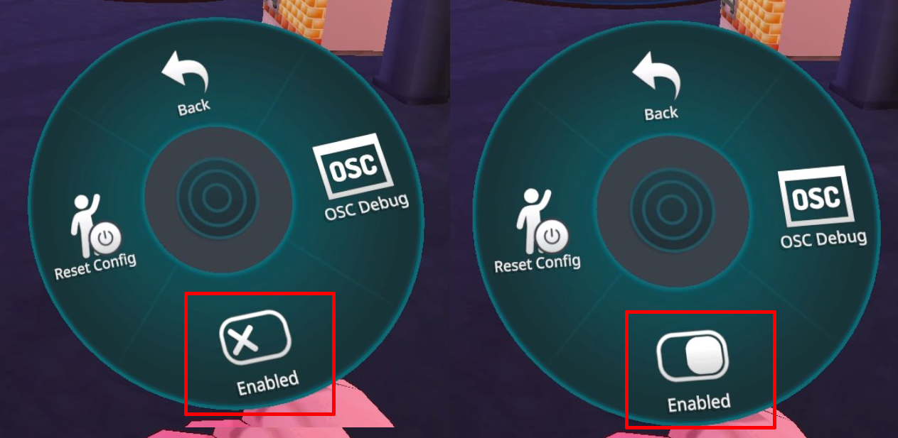
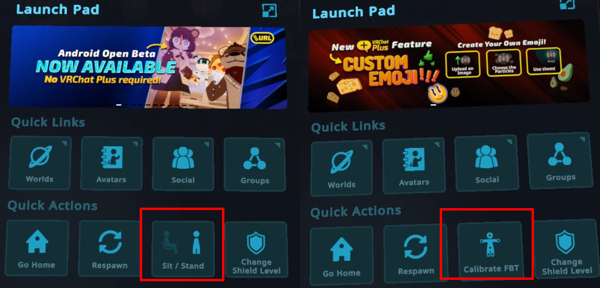
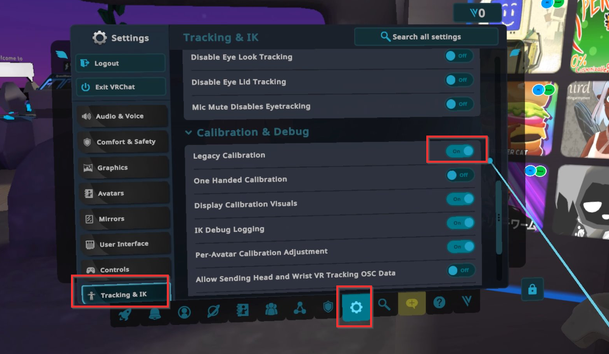
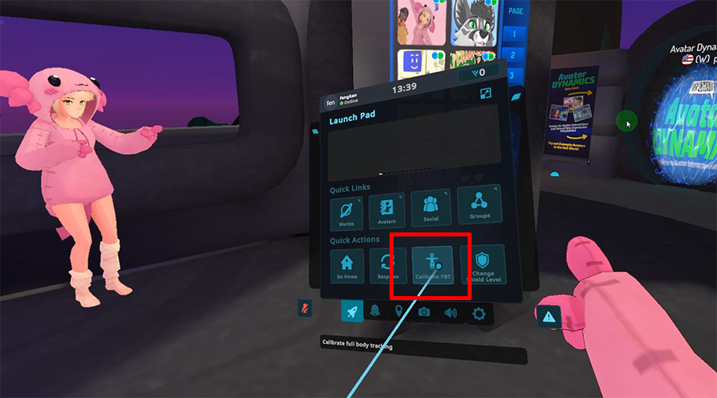
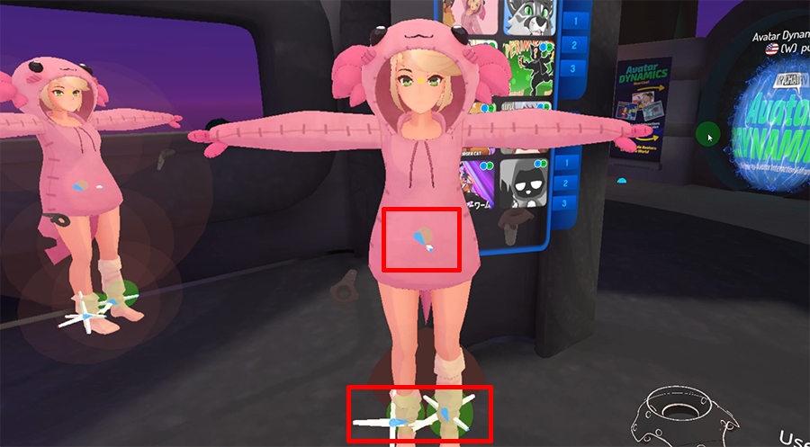

# VRChat Fullbody Tracking

:::info
The following Dollars MoCap product supports VRChat FBT,

- Dollars DEEP (since v.240306)
:::

## Preparations

### Dollars MoCap Side

Please enable VRChat Streaming. If necessary, modify the IP address and port.

### VRChat Side

#### Enable OSC

Open the Action Menu, and access the OSC settings via Options > OSC

Click 'Enabled' to activate OSC.

Depending on the controller you use, the method to open the Action Menu varies. Please refer to the following VRChat documentation.

https://docs.vrchat.com/docs/action-menu

After enabling OSC, the 'Sit/Stand' option in the Quick Menu will be replaced with the 'Calibrate FBT' option.

#### Legacy Calibration Mode

Additionally, it's recommended to set the Legacy Calibration option to On in the Settings.

Preparation is now complete.

## Calibration

After completing calibration in Dollars DEEP, click the "Calibrate FBT" option in the Quick Menu.

At this point, you should see trackers at your waist and leg positions.

Then, extend your arms to the sides and simultaneously pull the triggers on both hands to complete the calibration.