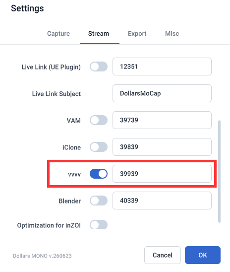

# Using Dollars MoCap in vvvv

You can stream Dollars MoCap's motion data to vvvv in real time, to control avatars or to build real-time visuals, interactive installations, and stage graphics.

:::info

The following Dollars MoCap products support real-time streaming to vvvv,

- Dollars MONO (from v.250716)

:::

## Preparation

### On the Dollars MoCap Side

In the Dollars MoCap settings, turn on the vvvv Streaming option. You can also change the port if needed.

### On the vvvv Side

On the vvvv side, the motion is received with the VL.DollarsMoCap package. For setup and usage, see the vvvv blog post [Introducing DollarsMoCap](https://vvvv.org/blog/2025/introducing-dollarsmocap/).

## Multi-person Mocap

Each avatar's motion is streamed on its own port, starting from the configured port and counting up by avatar number.

For example, with the port set to the default 39939, avatar 0 streams on 39939, avatar 1 on 39940, and so on.

In vvvv, add a receiver for each of these ports to drive multiple characters at the same time.
