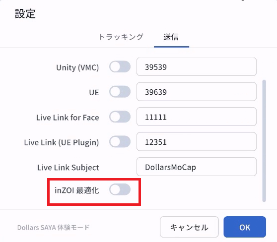

# inZOI 最適化

モーションデータを inZOI に送信する場合は、以下の 2 つの設定を順番に行うことをお勧めします。

## inZOI の VRM を読み込む

まず、[VRM の読み込み](./loadvrm.md) で inZOI に付属する VRM ファイルを読み込みます。モーションが inZOI キャラクターの体型に基づいて解算され、キャラクターによりフィットします。

## inZOI 最適化を有効にする

次に、SAYA の設定で inZOI 最適化オプションを有効にします。

## 改善される点

以上の 2 つの設定により、キャプチャ結果は以下の点で改善されます。

- 立ち姿勢がより自然になり、足の地面へのめり込みが軽減されます。

- 手を握りこぶしにした時の指の歪みが軽減されます。

