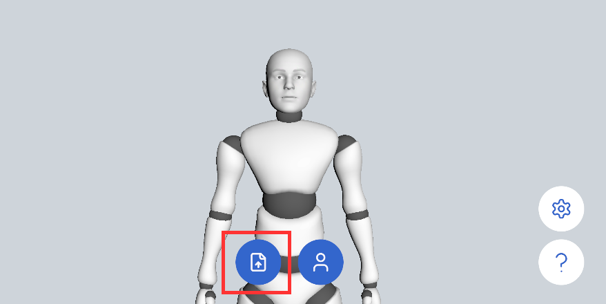

# VRM の読み込み

## なぜ VRM を読み込むのか

SAYA はデフォルトで、内蔵の Dollars MoCap モデルの体型に基づいてモーションを解算します。実際に使用するキャラクターが肩幅や腕の長さなどの比率で内蔵モデルと大きく異なる場合、合掌のような正確な位置合わせが必要なポーズにずれが生じ、両手が離れたり、互いにめり込んだりすることがあります。

VRM を読み込むと、SAYA はそのモデルのボーン比率に基づいてモーションを解算して出力します。体型の異なるキャラクターでも動きが自然にフィットし、肩幅などのパラメータを手動で入力する必要もありません。

## 手順

1. キャラクターの VRM ファイルを iOS デバイスに転送します。AirDrop、iCloud Drive、USB ケーブルなどが利用できます。
2. SAYA で下のボタンをタップし、表示されるダイアログで VRM を選択します。

読み込んだ VRM は、SAYA の起動時に毎回自動的に読み込まれます。

:::info ご注意

VRM の読み込みは Unity (VMC) プロトコルの出力にのみ影響します。他のプロトコルには影響しません。

:::
