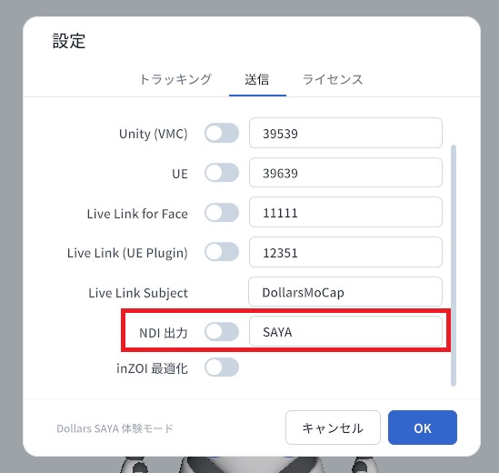

# NDI 出力

SAYA はレンダリング済みのアバター映像を NDI で同一ローカルネットワーク内のコンピュータに配信し、OBS のソースとして直接使用できます。レンダリングはデバイス上で行われるため、コンピュータ側でアバターソフトウェアを実行する必要がなく、配信や録画などの他の作業により多くのリソースを残せます。

## はじめる前に

まず [VRM の読み込み](./loadvrm.md) でアバターを読み込み、デバイスとコンピュータが同一ローカルネットワークにあることを確認してください。

## NDI 出力を有効にする

SAYA の設定で NDI 出力のスイッチをオンにします。スイッチ横の入力欄は NDI ソースの名前で、デフォルトは SAYA です。必要に応じて変更できます。

## OBS で受信する

初回のみ、コンピュータに OBS の NDI プラグイン DistroAV（旧 obs-ndi）と、それが依存する NDI ランタイムをインストールし、OBS を再起動してください。

OBS でソースを追加し、NDI Source を選択します。

ソース一覧からお使いのデバイスを選択します。名前は通常、デバイスの機種名に 4 文字のランダムな英字を加えたもので、括弧内には設定で入力した NDI 名が表示されます。選択すると、リアルタイムでレンダリングされたアバターが表示されます。

:::info ご注意

NDI 出力を有効にした後、ソースが OBS に表示されるまで 30 秒から 1 分ほどかかる場合があります。

しばらく待っても表示されない場合は、デバイスとコンピュータが同一ローカルネットワークにあることを確認し、コンピュータのファイアウォールが NDI をブロックしていないかご確認ください。

:::
