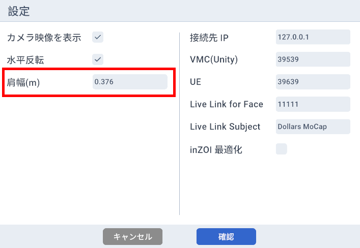

# プログラム設定

補足が必要な設定項目について説明します。

## 肩幅

最終表示に使用するモデルの左右の UpperArm ボーン間の水平距離を入力してください。

トラッキングの不正確さの可能性があるため、より良い結果を得るにはこの値を少し大きくすることをお勧めします。

デフォルト値は 0.376 で、これは Dollars MoCap アバターの UpperArm 距離に対応しています。

## inZOI 最適化

inZOI にデータを送信する際は、このオプションを有効にすることをお勧めします。

このオプションは以下の改善を提供します。

- 手を握りこぶしにした時の指の歪みを軽減します。

- 地面への足の貫通を最小限に抑えながら、より自然な立ち姿勢を実現します。

