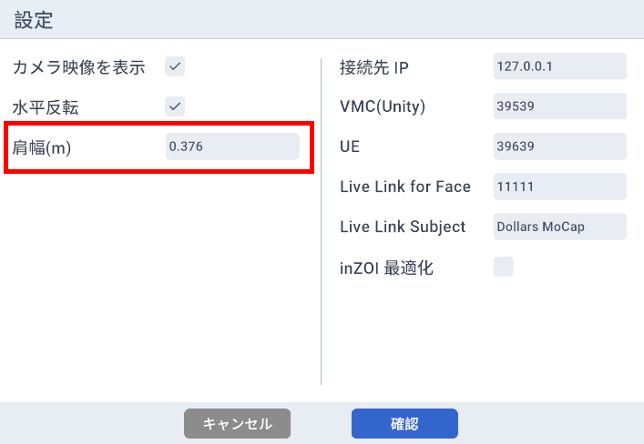
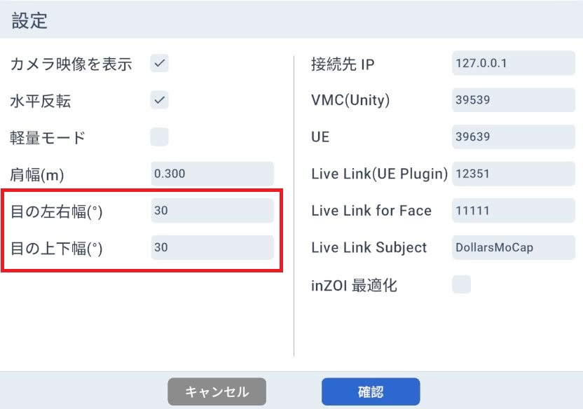
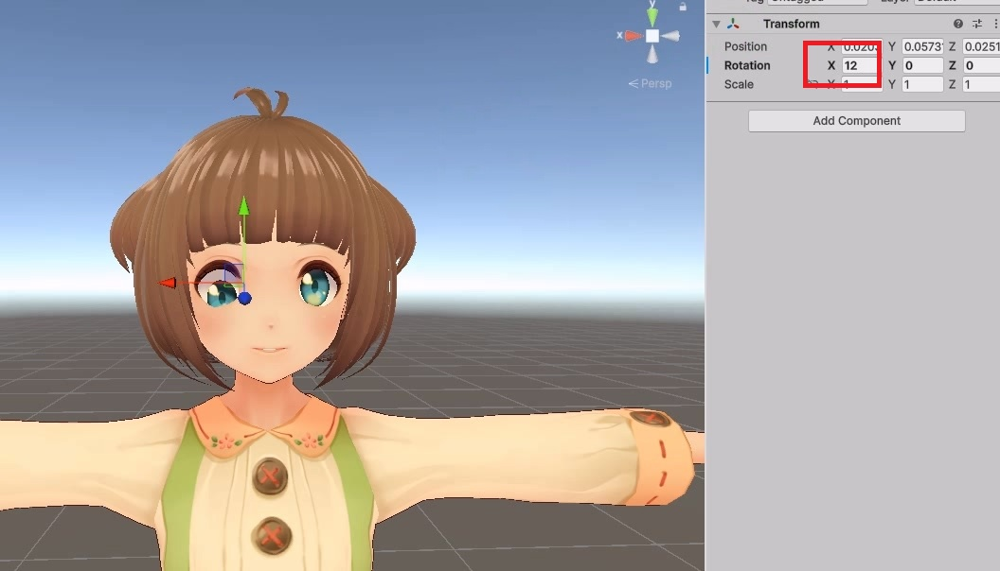
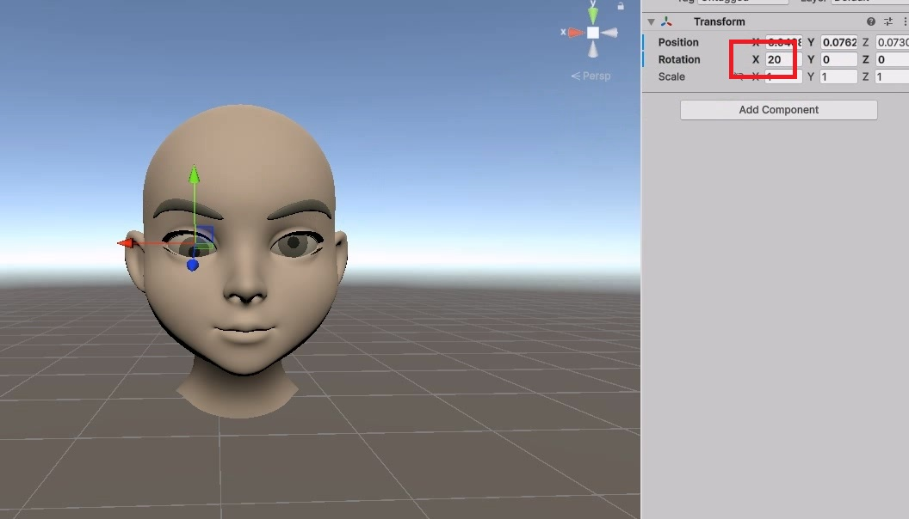
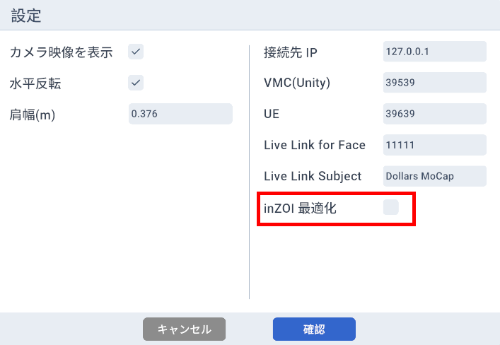

# プログラム設定

補足が必要な設定項目について説明します。

## 肩幅

最終表示に使用するモデルの左右の UpperArm ボーン間の水平距離を入力してください。

トラッキングの不正確さの可能性があるため、より良い結果を得るにはこの値を少し大きくすることをお勧めします。

デフォルト値は 0.376 で、これは Dollars MoCap アバターの UpperArm 距離に対応しています。

## 目の可動幅

一部のモデルでは、ARKit の目の BlendShape で眼球を動かすことができません。このようなモデルでは、代わりに眼球ボーンの VMC データで眼球の回転を制御し、モデルごとに目の左右幅と上下幅を設定できます。

モデルの眼球ボーンを片側の限界位置まで回転させ、そのときの角度を設定値として使用してください。

例えば、以下のモデルでは左右幅を 12 度に設定できます。

上下幅も同じく 12 度に設定できます。

一方、以下のモデルでは左右幅を 30 度に設定できます。

上下幅は 20 度に設定できます。

なお、眼球ボーンの向きは VRM 標準に準拠します。

また、通常は受信側でも幅を調整できます。以下は Warudo の例です。

## inZOI 最適化

inZOI にデータを送信する際は、このオプションを有効にすることをお勧めします。

このオプションは以下の改善を提供します。

- 手を握りこぶしにした時の指の歪みを軽減します。

- 地面への足の貫通を最小限に抑えながら、より自然な立ち姿勢を実現します。

