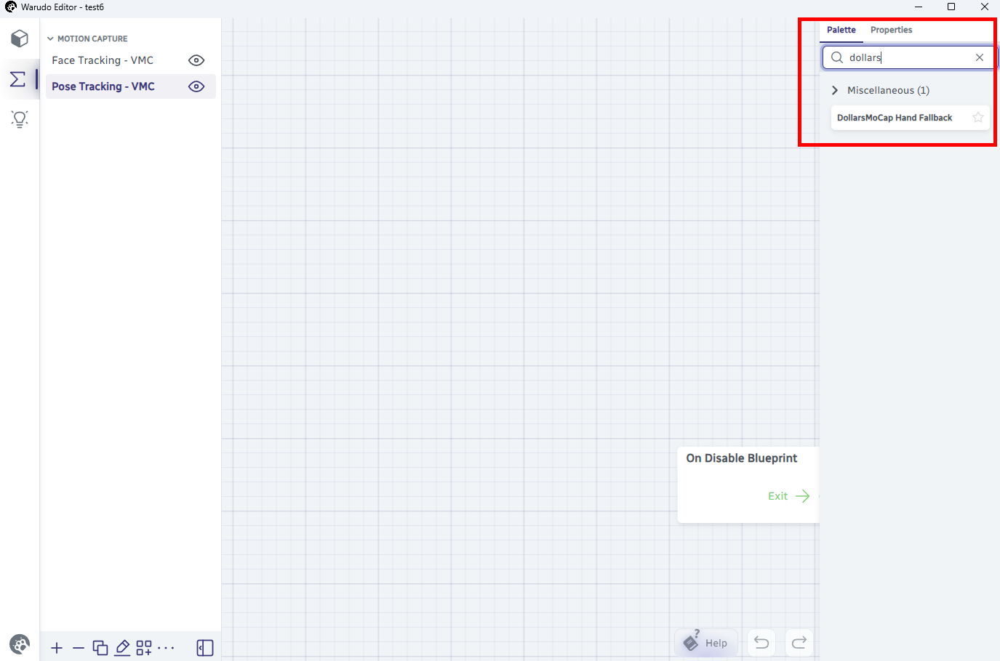
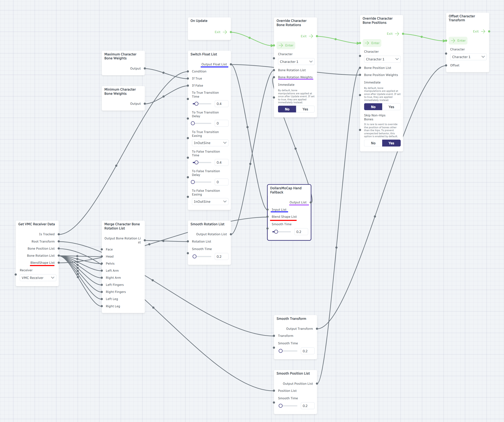

# Warudo ハンドアニメーションブレンド

Dollars SAYA は、手の可視状態に応じて、Warudo 内のモーションキャプチャとプリセットアニメーションを自動的に切り替えることができます。

:::info 注意
本記事でご紹介しているのは実装方法の一例です。より良い方法をご存知でしたら、ぜひ[お気軽にお問い合わせ](https://www.dollarsmocap.com/contact)いただけますと幸いです。
:::

## 前提条件

- Dollars SAYA が VMC プロトコルで Warudo に接続されていること

## 1. カスタムノードスクリプトのダウンロード

[Dollars MoCap ウェブサイト](https://www.dollarsmocap.com/download#misc)から **DollarsMoCapHandFallbackNode.cs** をダウンロードし、Warudo の Playground フォルダに配置してください。

```
<Warudoインストールディレクトリ>/Warudo_Data/StreamingAssets/Playground/DollarsMoCapHandFallbackNode.cs
```

:::tip Playground フォルダの場所
Warudo で **Menu → Open Data Folder** をクリックすると、開いたディレクトリ内に `Playground` フォルダがあります。
:::

Warudo が自動的にスクリプトをコンパイルして読み込みます。コンパイルが成功すると、ブループリントのノードリストに **DollarsMoCap Hand Fallback** ノードが表示されます。



## 2. VMC トラッキングブループリントの修正

Warudo で VMC の **Pose Tracking** ブループリントを開き、**Switch Float List** と **Override Character Bone Rotations** の2つのノードを見つけます。

まず、**Output Float List** と **Bone Rotation Weights** の間の接続を切断します。


次に、両者の間に **DollarsMoCap Hand Fallback** ノードを挿入し、下図のように接続します。



接続完了後のデータフローは以下の通りです。

| ポート | 接続元 |
|---|---|
| DollarsMoCap Hand Fallback → **Input List** | Switch Float List → Output Float List |
| DollarsMoCap Hand Fallback → **Blend Shape List** | Get VMC Receiver Data → BlendShape List |
| Override Character Bone Rotations → **Bone Rotation Weights** | DollarsMoCap Hand Fallback → Output List |

## Smooth Time の調整

DollarsMoCap Hand Fallback ノードには **Smooth Time** スライダー（デフォルト 0.2）があり、モーションキャプチャとプリセットアニメーション間の遷移の滑らかさを制御します。
